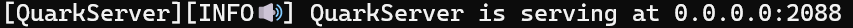
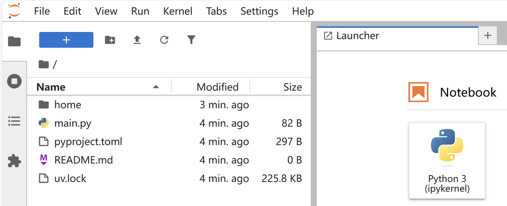
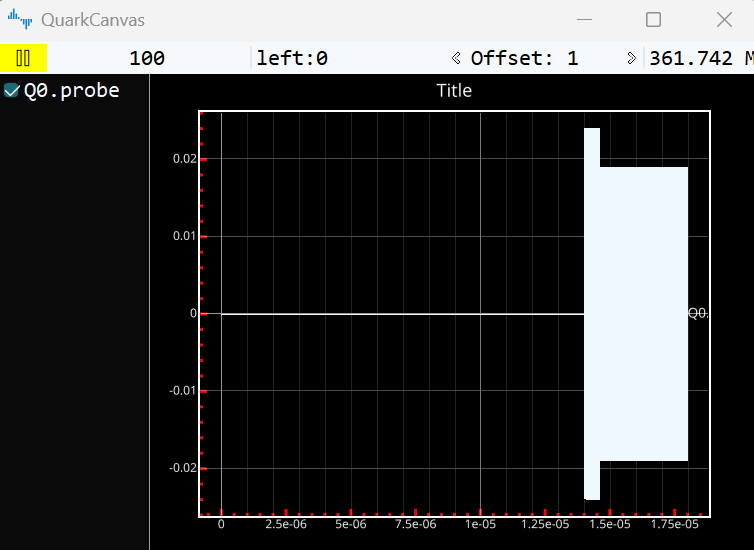
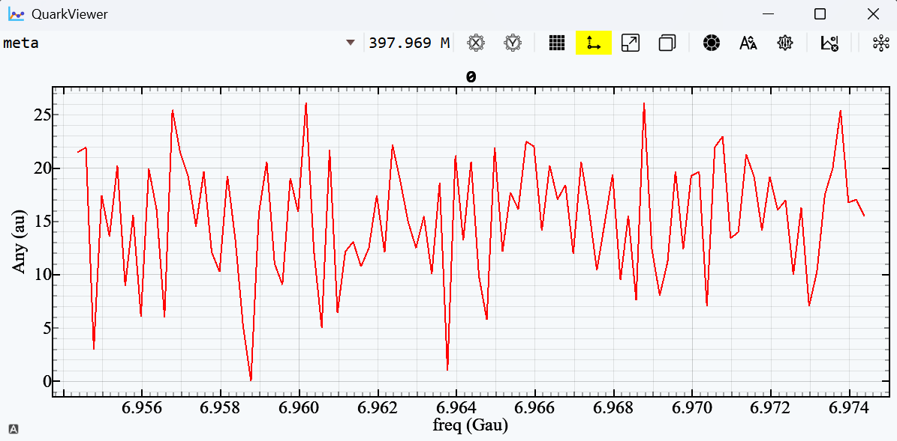
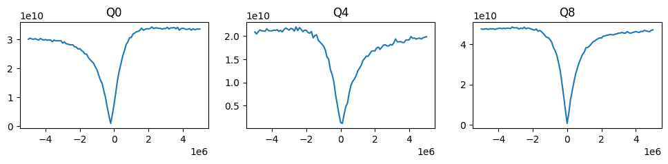
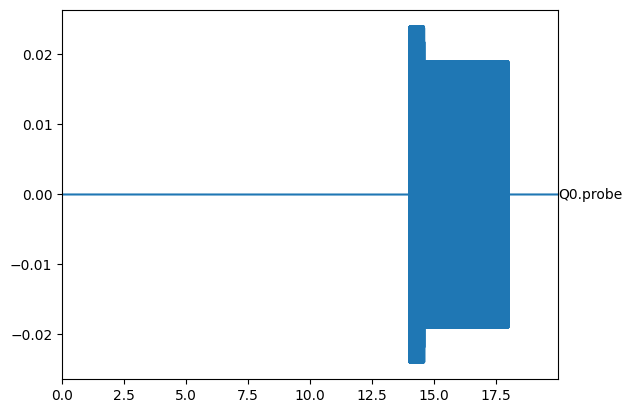

---
hide:
  - navigation
  # - toc
---

# **Beginner's Guide**

## **安装配置**
### ***系统工具***

- 安装[**git**](https://git-scm.com/)

    === "Windows"
        点击上方链接下载安装。成功后以下命令应当输出版本号
        ```pwsh-session
        PS> git -v
        git version 2.45.0.windows.1
        ```

    === "macOS"
        在终端输入`git`，如未安装则按提示安装。成功后以下命令应当输出版本号
        ```console
        $ git -v
        git version 2.39.5 (Apple Git-154)
        ```

- 安装[**uv**](https://docs.astral.sh/uv/)

    <!-- powershell -ExecutionPolicy Bypass -File .\uv-installer.ps1 -->

    === "Windows"
        ```pwsh-session
        PS> powershell -ExecutionPolicy ByPass -c "irm https://astral.sh/uv/install.ps1 | iex"
        Downloading uv 0.8.24 (x86_64-pc-windows-msvc)
        Installing to C:\Users\***\.local\bin
        uv.exe
        uvx.exe
        uvw.exe
        everything's installed!
        ```

        成功后以下命令应当输出版本号
        ```pwsh-session
        PS> uv -V
        uv 0.9.0 (39b688653 2025-10-07)
        ```

    === "macOS"
        ```console
        $ curl -LsSf https://astral.sh/uv/install.sh | sh
        downloading uv 0.9.0 x86_64-apple-darwin
        no checksums to verify
        installing to /Users/***/.local/bin
        uv
        uvx
        everything's installed!

        To add $HOME/.local/bin to your PATH, either restart your shell or run:

            source $HOME/.local/bin/env (sh, bash, zsh)
            source $HOME/.local/bin/env.fish (fish)
        ```

        成功后以下命令应当输出版本号
        ```console
        $ uv -V
        uv 0.9.0 (39b688653 2025-10-07)
        ```

    ???+ warning "注意"
        **uv**安装取决于网络环境，快则十数秒，慢则可能约5到10分钟，看似卡死，多等会就好！

### ***测量环境***
- 安装[**Python**](https://python.org/)

    进入桌面并创建基于python3.12的工作环境**qlab**(1)。**注意**：python3.12不必事先安装好！
    { .annotate }
        
    1. :material-folder: qlab
        - qlab文件夹名可任意
        - 不同文件夹之间相互独立
        - 因此可以在同一电脑上创建多个测量环境

    ```bash
    cd ~/Desktop
    uv init --python 3.12 --vcs none qlab
    ```

    进入qlab目录
    ```bash
    cd qlab
    ```


- 安装**quarkstudio**
    ```bash
    uv add quarkstudio --default-index=https://mirrors.tuna.tsinghua.edu.cn/pypi/web/simple
    ```

    下载驱动等文件到指定目录，如./home
    ```bash
    uv run quark init --home ./home -i https://mirrors.tuna.tsinghua.edu.cn/pypi/web/simple
    ```

    ???+ tips "安装后qlab目录"
        ```bash
        qlab
        ├── .venv # Python环境
        │   ├── etc
        │   ├── include
        │   ├── Lib # site-packages
        │   ├── etc
        │   ├── Scripts # 安装后的可执行命令
        │   ├── ...
        ├── home
        │   ├── cfg # cfg表目录
        │   ├── dev # 设备驱动
        │   ├── lib # arch和门定义
        │   ├── run # 云相关函数及s21范例
        │   └── ...
        ├── .python-version # Python版本文件
        ├── main.py # 示例文件，可删除
        ├── pyproject.toml # 配置文件，不可删除！
        ├── README.md # 说明文件，可删除
        └── uv.lock # 版本管理，uv自动生成
        ```


## **实验过程**
### **启动服务**
- 打开终端，确保切换到**qlab**目录下，执行`uv run quark server`以启动[**QuarkServer**](quark/server.md)(后以**server**代称)。启动成功如下图所示，
- 打开另一终端，确保切换到**qlab**目录下，执行`uv run jupyter notebook`
- 新建一个notebook，后续所有操作均在此notebook中进行


### **准备工作**
- #### **导入模块**
    ```python
    import matplotlib.pyplot as plt
    import numpy as np
    from quark.app import Recipe, s  # (1)!
    ```

    1. :material-language-python: quark.app
        - Recipe: 记录任务信息，生成任务描述
        - s: 与server进行交互的工具，如
            - 更新参数：`s.update('Q0.Measure.frequency', 5.321e9)`
            - 查询参数：`s.query('Q0.Measure.frequency')`
            - 写设备：`s.write('ZW_AD3.CH1.Offset', 0.2)`
            - 读设备：`s.read('ZW_AD3.CH1.Offset')`
            - `s.submit`: 向server提交Recipe生成的任务描述


- #### **注册登录**
    ```python
    # 如果login报错，提示 LookupError: User "test" not found, signup first!
    # 则运行注册操作(1)，成功后再回到这里login
    s.login('test')
    ```

    1. :material-language-python: signup
        ```python
        # 注册用户test，并将比特参数存于myexperiment.json（位于~/Desktop/qlab/home/cfg下）
        # siginup执行一次就好
        s.signup('test','myexperiment')
        ```

- #### **添加比特和设备**
    ```python title="比特" linenums="1"
    # 定义比特
    Q0 = {
        "Measure": {  # 生成读取波形，送入probe通道
            "duration": 4e-06,
            "amp": 0.019,
            "frequency": 6964370000.0,
            "weight": "const(1)",
            "phi": -2.636421695283167,
            "threshold": 8502633802.265065,
            "ring_up_amp": 0.024,
            "ring_up_waist": 0.006,
            "ring_up_time": 6e-07
        },
        "acquire": {  # 采集通道（从制冷机出来的信号）
            "address": "AD.CH13.IQ",
            "TRIGD": 0
        },
        "probe": {  # 读取通道（进入制冷机的信号）
            "address": "AWG.CH2.Waveform",
            "delay": 0
        }

    }
    # 添加Q0到server
    s.update('Q0', Q0)  # 'Q0'名称任意
    ```
    ```python title="设备" linenums="1"
    # 设备列表
    dev = {
        'AD': {  # 采集卡
            "addr": "192.168.1.2",  # 设备板卡ip
            "name": "dev.VirtualDevice",  # 设备模块路径，换成实际设备驱动
            "type": "driver",  # 直连设备，即无需通过remote服务
            "srate": 1e9,  # 采样率，读取自设备驱动的srate属性
        },
        'AWG': {  # 任意波形发生器
            "host": "192.168.1.3",  # 设备内操作系统的ip
            "port": 8000,  # 设备remote服务端口
            "type": "remote",  # 远程设备，通过remote服务连接，需在设备上运行remote服务
            "srate": 4e9,
        },
        'Trigger': {  # 触发源
            "addr": "192.168.1.4",
            "name": "dev.VirtualDevice",
            "type": "driver",
            "srate": 1e9
        }
    }
    # 添加设备到server
    for k, v in dev.items():
        s.update(f'dev.{k}', v)
    ```

    ```python title="设置" linenums="1"
    # 全局设置
    station = {
        "sample": "test_111",  # 样品名，仅记录用
        "triggercmds": ["Trigger.CH1.TRIG"],  # 触发命令
        "lib": "lib.gates.u3rcp",  # gate库路径
        "arch": "rcp",  # 体系结构，位于lib.arch
        "align_right": True,  # 波形对齐右侧
        "waveform_length": 18e-6,  # 波形长度
        "auto_clear": {  # 自动清空的命令
            "init": ['flux', 'drive'],  # 任务初始化时，清空flux和drive通道
            "main": ['flux', 'drive'],  # 任务主循环中，清空flux和drive通道
            "post": ['flux', 'drive']  # 任务结束后，清空flux和drive通道
        },
    }
    # 添加设置到server
    s.update('station', station)

    ```

- #### **打开设备**
    ```python
    # 打开设备，必须运行否则后续任务无法提交！！！
    s.start()
    ```

### **测量样例（s21）**

- #### 生成任务

    <!-- ???+ tips "三步走"
        1. 定义线路
        2. 定义变量
        3. 提交任务 -->

    ``` mermaid
    graph LR
    A[定义线路] --> B[定义变量];
    B --> C[提交任务];
    ```

    ```python title="任务" linenums="1" hl_lines="4 12 18"
    def circuit_s21(qubits: tuple[str], freq: float, ctx=None) -> list:
        """定义线路函数。ctx为编译所需上下文，主要用于对cfg表进行查询等操作。
        """
        cc = [(('Measure', i), q) for i, q in enumerate(qubits)]
        return cc

    rcp = Recipe('s21', signal='iq_avg')
    rcp.circuit = circuit_s21  # 指定扫描线路函数(1)

    qubits = ['Q0']
    rcp['qubits'] = tuple(qubits)  # 必须为tuple，传与circuit_s21的qubits
    rcp['freq'] = np.linspace(-10, 10, 101) * 1e6  # 定义扫描范围，传与circuit_s21的freq(2)

    for q in qubits:
        rcp[f'{q}.Measure.frequency'] = rcp['freq'] + \
            s.query(f'{q}.Measure.frequency')  # 在中心频率正负10M范围内扫描

    s21 = s.submit(rcp.export(),
                block=False,  # 是否阻塞当前任务至结束
                #    preview=['Q0'],  # 指定要查看的实时波形(3)
                #    plot=True  # 是否查看实时的测量数据(4)
                )
    s21.bar()
    ```

    1. :man_raising_hand: 关于qlisp
        ```python title="GHZ示例" linenums="1"
        circuit = [
            ('H', 'Q0'),
            ('Cnot', ('Q0', 'Q1')),
            ('Cnot', ('Q1', 'Q2')),
            ('Cnot', ('Q2', 'Q3')),
            ('Barrier', ('Q0', 'Q1', 'Q2', 'Q3')),
            (('Measure', 0), 'Q0'),
            (('Measure', 1), 'Q1'),
            (('Measure', 2), 'Q2'),
            (('Measure', 3), 'Q3'),
        ]
        ```


        **常用门**
        <div style="font-size: 0.6em; max-height: 300px; overflow-y: auto; overflow-x: auto;">

        | statement | gate | matrix |
        |:---------:|:----:|:------:|
        |('I', 'Q0')|  $I$   | $\begin{pmatrix}1 & 0\\0 & 1\end{pmatrix}$ |
        |('X', 'Q0')|  $\sigma_x$   | $\begin{pmatrix}0 & 1\\1 & 0\end{pmatrix}$ |
        |('Y', 'Q0')|  $\sigma_y$   | $\begin{pmatrix}0 & -i\\i & 0\end{pmatrix}$ |
        |('Z', 'Q0')|  $\sigma_z$   | $\begin{pmatrix}1 & 0\\0 & -1\end{pmatrix}$ |
        |('H', 'Q0')|  $H$   | $\frac{1}{\sqrt{2}}\begin{pmatrix}1 & 1\\1 & -1\end{pmatrix}$ |
        |('S', 'Q0')|  $S$   | $\begin{pmatrix}1 & 0\\0 & i\end{pmatrix}$ |
        |('-S', 'Q0')|  $S^{\dagger}$   | $\begin{pmatrix}1 & 0\\0 & -i\end{pmatrix}$ |
        |('T', 'Q0')|  $T$   | $\begin{pmatrix}1 & 0\\0 & e^{i\pi/4}\end{pmatrix}$ |
        |('-T', 'Q0')|  $T^{\dagger}$   | $\begin{pmatrix}1 & 0\\0 & e^{-i\pi/4}\end{pmatrix}$ |
        |(('Rx', theta), 'Q0')|  $R_x(\theta)$   | $\exp\left(-i\frac{\theta}{2}\sigma_x\right)$ |
        |(('Ry', theta), 'Q0')|  $R_y(\theta)$   | $\exp\left(-i\frac{\theta}{2}\sigma_y\right)$ |
        |(('Rz', phi), 'Q0')|  $R_z(\theta)$   | $\exp\left(-i\frac{\phi}{2}\sigma_z\right)$ |
        |('X/2', 'Q0')|  $R_x(\pi/2)$   | $\exp\left(-i\frac{\pi}{4}\sigma_x\right)$ |
        |('-X/2', 'Q0')|  $R_x(-\pi/2)$   | $\exp\left(i\frac{\pi}{4}\sigma_x\right)$ |
        |('Y/2', 'Q0')|  $R_y(\pi/2)$   | $\exp\left(-i\frac{\pi}{4}\sigma_y\right)$ |
        |('-Y/2', 'Q0')|  $R_y(-\pi/2)$   | $\exp\left(i\frac{\pi}{4}\sigma_y\right)$ |
        |('iSWAP', ('Q0', 'Q1'))|  $i\mathrm{SWAP}$   | $\begin{pmatrix}1&0&0&0\\0&0&i&0\\0&i&0&0\\0&0&0&1\end{pmatrix}$ |
        |('Cnot', ('Q0', 'Q1'))|  $Cnot$   | $\begin{pmatrix}1&0&0&0\\0&1&0&0\\0&0&0&1\\0&0&1&0\end{pmatrix}$ |

        </div>

    2. :man_raising_hand: 变量定义
        - list或np.ndarray被视为变量
        - 所以，rcp['qubits']必须转为tuple
    3. :man_raising_hand: 切换到qlab目录，打开QuarkCanvas
        ```bash
        uv run quark canvas
        ```
         
    4. :man_raising_hand: 切换到qlab目录，打开QuarkViewer
        ```bash
        uv run quark viewer
        ```
         

- #### 获取结果
```python title="数据处理" linenums="1"
rs = s21.result()
signal = rs['meta']['other']['signal'].split('|')[0]

r = np.asarray(rs['data'][signal])
ax = plt.subplots(1, 3, figsize=(12, 2))[1].flatten()
for i, q in enumerate(qubits):
    fq = rs['meta']['axis']['freq']['def']
    rq = np.abs(r)[:, i]
    ax[i].plot(fq, rq)

    ax[i].set_title(f'{q}')
# 下图来自实验数据
```



- #### 常用函数

    ???+ abstract annotate "常用函数"
        - s21.report()：获取任务错误信息
        - s21.cancel()：取消任务执行流程
        - s21.circuit(0)：查看第0步线路
            ```python 
            [(('Measure', 0), 'Q0')]
            ```
        - s21.step(0)：查看第0步命令 (1)

            ```python 
            from quark.app import preview

            cmds = s21.step(0)
            wfv = preview(cmds['main'], start=0, end=20e-6, srate=5e9, keys=['Q0'])
            ```
            


    1.  :man_raising_hand: 查看命令cmds
        - cmds由编译生成，包含全部指令
        - cmds由三部分构成，依次顺序执行，分别为
            - cmds['main']: 写波形（驱动、偏置、读取等所有波形，可由`preview`函数看波形）、设置AD(如Shots、解调系数等)。
            - cmds['trig']: 待cmds['main']中命令全部就绪，触发设备开始发**trigger**。***trigger数量务必与AD中的Shots设置一致！！！***
            - cmds['READ']: 从设备将数据读回。如果没有数据返回或TIMEOUT，***第一时间检查触发设置***！！！
        - 若对下发到设备的指令存疑，可逐一排查cmds或单独执行cmds中命令以确定问题所在！
