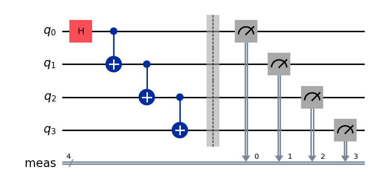
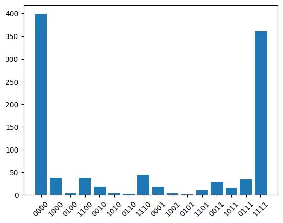

---
hide:
  - navigation
  - toc
---

# 
<div class="grid cards" style="width:900px;" markdown>

-   :material-language-python:{ .lg .middle } 1. 安装配置

    ---
    !!! abstract "量子计算云平台"
        - 夸父量子计算云平台（https://quafu.baqis.ac.cn）由北京量子院、中科院物理所及清华大学开发维护，为用户提供方便快捷的通道以访问量子计算资源。
        - 我们同时提供更为快捷的基于`QuarkStudio`的接口，用于直连超导量子芯片后端，以适应诸如qiskit等工具链，以下对`QuarkStudio`使用作简要说明。

    - 安装Python(**>=3.12**)
    - 安装`QuarkStudio`
        ```bash
        pip install quarkstudio
        ```
    - 实例化任务管理器
        ```python
        from quark import Task
        tmgr = Task('token')
        ```
      > 1. 获取token或使用帮助：quafu_ts@baqis.ac.cn
      > 2. token有效期30天，***请勿分享***！
</div>

<div style="page-break-after: always;"></div>

<div class="grid cards" style="width:1200px;" markdown>
-   :simple-task:{ .lg .middle } 2. 生成线路

    ---

    - 目标线路
    ```python
    # 线路生成可以使用qiskit/pyquafu等工具库
    # 以qiskit为例
    from qiskit import QuantumCircuit

    qc = QuantumCircuit(4)
    qc.h(0)
    for i in range(3):
        qc.cx(i, i+1)
    qc.measure_all()
    qc.draw('mpl')
    ```
    <!--  -->

    
    <figure markdown="span">
      { width="800" }
      <!-- <figcaption>Image caption</figcaption> -->
    </figure>

    - OpenQASM2.0
    ```python
    from qiskit import qasm2

    # 将qc转换为OpenQASM2.0的形式
    circuit = qasm2.dumps(qc)
    ```
</div>
<div style="page-break-after: always;"></div>
<div class="grid cards" style="width:1200px;" markdown>
-   :simple-internetcomputer:{ .lg .middle } 3. 任务交互

    ---
    
    - 查看芯片
    ```python
    # 查看可用芯片及其在线状态
    tid = tmgr.status()
    ```

    - 定义任务
    ```python
    task = {'chip': 'Dongling', # 选择芯片
            'name': 'MyJob', # 任务名称
            'circuit':circuit,
            }
    ```

    - 提交任务
    ```python
    # 提交并获取任务id
    tid = tmgr.run(task)
    ```

    - 取消任务
    ```python
    tmgr.cancel(tid)
    ```

    - 查询任务状态
    ```python
    tmgr.status(tid)
    ```
    > 任务以异步方式执行，提交完成后进入任务队列，根据任务id可在此后任意时间查看或获取结果
</div>

<div style="page-break-after: always;"></div>

<div class="grid cards" style="width:1200px;" markdown>
-   :material-chart-bell-curve:{ .lg .middle } 4. 获取结果

    ---
    - 获取结果
    ```python
    # 根据任务id获取任务结果
    res = tmgr.result(tid)
    ```

    - 示例
    ```python
    data = res['count']
    bases = sorted(data)
    count = [data[base] for base in bases]

    plt.bar(bases, count)
    ticks = plt.xticks(rotation=45)
    ```
    <figure markdown="span">
      { width="800" }
      <!-- <figcaption>Image caption</figcaption> -->
    </figure>

    > 示例下载：https://quarkstudio.readthedocs.io/en/latest/usage/cloudnote/

</div>
