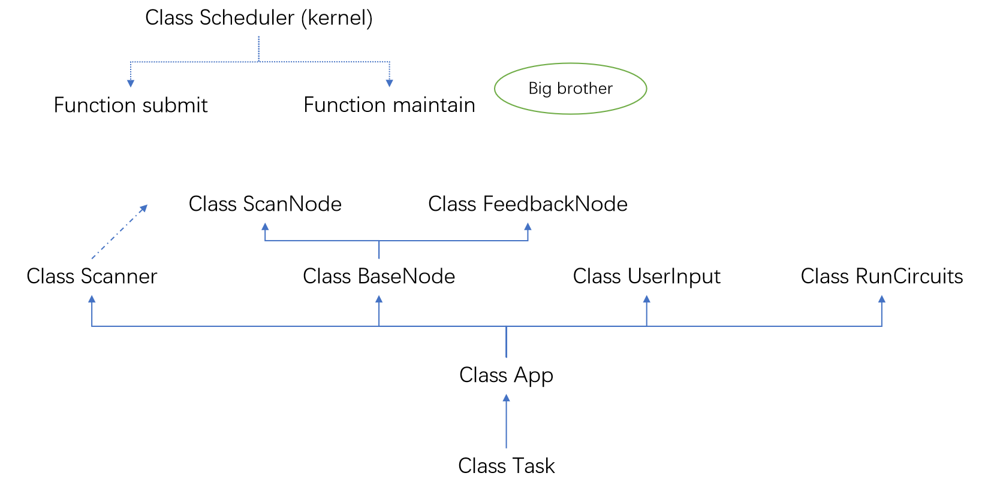
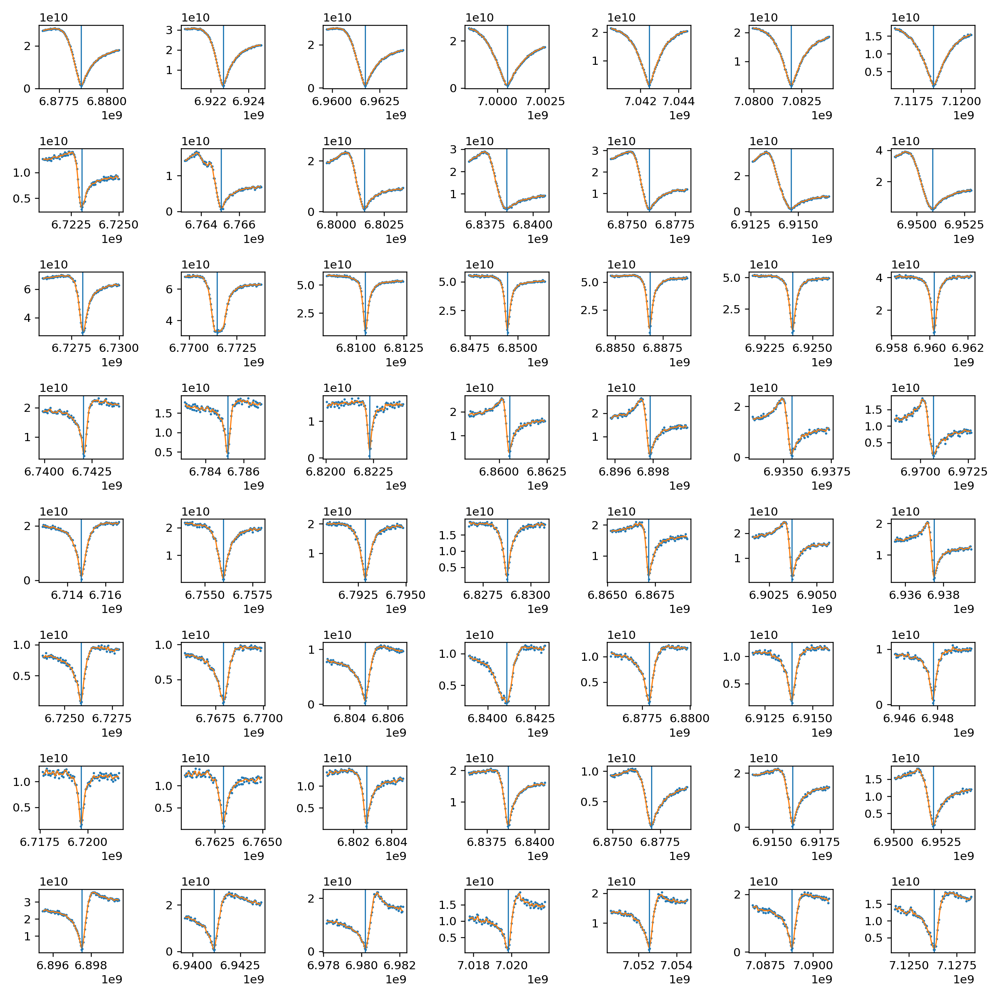

# QOS实验用户使用手册

## 概览

### 组织结构

这里在用户层面上展示了可能涉及的组织架构。



在这个框架下，实线箭头表示了类之间的继承关系，虚线箭头表示了潜在的使用依赖。`Task`类作为一个测量任务的基础描述单元，无论进行了如何的包装，都会提交给调度器`Scheduler`类即`kernel`进行执行，而`submit`和`maintain`蕴含了不同的执行逻辑。事实上`App`的接口依然开放，用户可以根据自己的需求创建新的子类来满足不同实验的需要，例如正在开发的带反馈式的二分扫描方案。

## Task类及其衍生

### Task和App

to be continued

### UserInput

该类型不执行任何实际测量，只是提供一个让用户输入参数的接口并输入该参数。实际实验中暂时用不到。

### RunCircuits

`RunCircuits`提供在参数已经全部在参数表中且维护好的前提下执行一组线路的功能。通过以下代码来执行：

```python
import kernel
task = kernel.exec(circuit, signal='state', shots=1024, no_record=True)
```

此时该组线路已经提交执行，函数`kernel.exec`返回的对象为`RunCircuits`对象，返回数据可以通过`task.result()`方法进行获取。在上述语句中，参数`circuit`为待执行线路，只支持`qlisp`语法，如果需要其他语法，请参考下文中`Scanner`节中对线路转换函数`circuit_convert`的介绍提前进行转换；参数`signal`指该次返回的数据类型，`shots`指该次测量重复次数，`no_record`为真时表示该次测量不在数据库中留下任何记录和信息。

### Scanner

`Scanner`支持以配置字典作为输入信息的形式进行无反馈式扫描，且支持原代码系统中的约束管理器。为方便区分，这里的约束管理器指按照特定顺序更新参数的参数管理系统。

```Python
# import 地址及位置
from qos_tools.experiment import Scanner

# 生成配置字典，具体生成方式请参见后文
para_dict = {}

# 通过kernel创建和初始化名为test的测量任务，名称可随意更换
import kernel
test = kernel.create_task(Scanner, args=(), kwds=para_dict['init'])
test.init(**para_dict)

# 此时本次扫描任务已经生成完毕，可以向kernel提交执行
test = kernel.submit(test)
```

`Scanner`只支持通过`kernel.submit`提交任务，不支持其他提交方式；且不支持自动更新和维护参数表。在`Scanner`内部只做临时的修改。

#### 配置字典

以下是一个配置字典的简要说明。

```Python
 {
	# 初始化字段'init'，对应一个字典，值内容表示支持的数据类型
	'init': {
		'name': str, # 实验名称，作为调度器区分不同实验的依据之一
		'qubits': list[int], # 作用的qubits，目前仅作为调度器区分不同实验的依据之一
		'signal': str, # 信号类型，对应于task.signal参数
		'scanner_name': str, # 本扫描器对应的lib中函数的名称，目前仅为支持UI用
	},
	
	# 预配置字段'setting'，对应一个字典，也是临时变量存储区 
	'setting': {
		'pre_setting': dict, # 本次实验的预设内容，{地址:预设值}，只是在本任务循环开始前设置，本次扫描结束后会撤销，不会对参数表造成最终修改
		'compile_once': bool, # 波形编译加速选项，为真表示只在第一组参数扫描时编译波形，其他参数默认不修改awg波形
		'circuit_type': str, # 线路类型转换命令
		'circuit': Any, # 传入线路，数据类型为对应的线路形式
	},
	
	# 约束更新字段'constrains', 具体原理及语法形式请参见约束管理部分
	'constrains': list[tuple],
	
	# 扫描配置字段'sweep_config', 对应一个字典，主要用来描述扫描中可变量地址及其他附属信息
	'sweep_config': dict, # 具体格式: {'var_name': {'addr': '', ...}, ...}
	
	# 扫描设置字段'sweep_setting', 对应一个字典，具体语法请参见scan_iters部分
	'sweep_setting': dict,
	
	# 扫描附加字段'sweep_addition', 对应一个字典，为scan_iters的附属展开，一定程度上可以替代约束更新
	'sweep_addition': dict,
	
	# 可选传入字段: 'mask_func', 对应一个函数(可调用对象)，为scan_iter的辅助使用，
	'mask_func': None or callable
```

例如，扫一个S21的实验，在混频方案下，可以选择固定local的频率改awg的波形，也可以选择固定awg波形改local的频率，显然后者的速度要更快一些。如果选择后者，那么参数之间存在一组关系，即sideband频率不变，也就是local的频率和实际测量频率的差值维持不变，这样一组关系可以使用多种方式来描述，使用约束管理更新的方式（这也更加贴合上个版本），那么其完整实验代码如下，当然具体细节会在后续展开。

```Python
from qos_tools.experiment import Scanner
import kernel

# 同时扫描Q0, Q1, Q2的S21, 创建需要的作用
qubits = [0, 1, 2] 

# 通过kernel查询config中对应qubit的probe, 即对应的readout line, 并去重
measures = set(kernel.get(f'Q{i}.probe')for i in qubits)

para_dict = {
	'init': {
		'name': 'S21',
		'qubits': qubits, 
		'signal': 'raw', # 选择原始信号，不做态的区分
	},
	'setting': {
		'delta': 0, # 约束管理更新的临时变量
		'qubit_frequency': {
		f'Q{i}': kernel.get(f'gate.Measure.Q{i}.params.frequency') for i in qubits
		}, # 约束管理更新临时变量
		'LO_frequency': {
		f'{m}': kernel.get(f'{m}.setting.LO') for m in measures
		}, # 约束管理器临时更新变量
		'pre_setting': {},
		'compile_once': True, # 因为此时不需要改波形，所以编译一次开关打开
		'circuit_type': 'cmds:qlispcmd',
		'circuit': [
			(('Measure', j), f'Q{i}') for j, i in enumerate(qubits)
		],
	},
	# 约束管理更新部分
	'constrains': [
		*[((f'setting.qubit_frequency.Q{i}', 'setting.delta'), 
		lambda a, b: a+b,
		f'gate.Measure.Q{i}.params.frequency') for i in qubits],
		*[((f'setting.LO_frequency.{m}', 'setting.delta'),
		lambda a, b: a+b,
		f'{m}.setting.LO') for m in measures],
	],
	'sweep_config': {
		'delta': {'addr': 'setting.delta',},
	},
	'sweep_setting': {
		'delta': sweep_list,
	},
}

test = kernel.create_task(Scanner, args=(), kwds=para_dict['init'])
test.init(**para_dict)

test = kernel.submit(test)
```

#### 线路转换 circuit_convert

主要对于之前`gatemap`的格式向`qlisp`进行转换，实际上是一个可以独立的工具模块。`gatemap`和`cmds`是线路（circuit）模型的不同表现形式， `gatemap`是二维形式， `cmds`是一维形式，两者可以通过一定的方式互相转换。函数`circuit_convert`提供了这一转换方式，由于QOS编译架构目前支持`qlisp`语法，但为快速编写，提供了辅助功能完成路线转换。

##### gatemap

`gatemap`表现为字典形式，字典的键值对分别是比特名字和门索引序列的列表，其中门索引index 可以有不同的规范，比如下面小节将介绍的`stdindex/strindex/tupindex`。示例如下：

###### gatemap: tupindex

```python
gatemap_tupindex = {
'Q1': ['X', 'X/2', 'Barrier:1', 'CZ(Q1,Q2)', 'I', ('U',0,180), 'Barrier:3' ],
'Q2': ['-Y/2', 'Barrier:1', 'CZ(Q1,Q2)', 'Barrier:2', 'CZ(Q2,Q3)', 'I', 'Y', 'Barrier:3' ],
'Q3': [ 'Barrier:2', 'CZ(Q2,Q3)', 'I', 'Y', 'Barrier:3', 'Y']
}
```

###### gatemap: strindex

```python
gatemap_strindex = {
'Q1': ['X', 'X/2', 'Barrier:1', 'CZ(Q1,Q2)', 'I', 'U_0_180', 'Barrier:3' ],
'Q2': ['-Y/2', 'Barrier:1', 'CZ(Q1,Q2)', 'Barrier:2', 'CZ(Q2,Q3)', 'I', 'Y', 'Barrier:3', ],
'Q3': [ 'Barrier:2', 'CZ(Q2,Q3)', 'I', 'Y', 'Barrier:3', 'Y'],
}
```

###### 索引对齐标记

`gatemap`中有一种特殊的索引-对齐标记`:`，具有如下规则：

1. 对齐标记是一种特殊的索引；
2. 对齐标记是为了在编译时对齐脉冲波形，形式为上面示例中的 (`'Barrier:1'` ,` 'Barrier:2'` 等)。实际编译时只要包含 `:` 的字符串都会被识别为对齐标记，比如 `':a'` ,`'a:'`, `':skdhfjsk:'` 等；
3. 可以多个比特同时对齐；
4. 同一个比特序列中不能出现两次相同的对齐标记；
5. 不同比特之间的标记不能相互矛盾；
6. 多比特门索引的前面必须要有对齐标记，比如示例中的两比特CZ门。

##### cmds

`cmds`表现为列表形式，由按顺序排列的`cmd`组成，命令cmd也可以有不同的规范，比如下面小节将介绍的`stdcmd/qlispcmd`。示例如下：

###### cmds: stdcmd
```python
cmds_stdcmd = [
	('-Y/2', ('Q2',), ()),
	('X', ('Q1',), ()),
	('X/2', ('Q1',), ()),
	('Barrier', ('Q1', 'Q2'), ()),
	('CZ', ('Q1', 'Q2'), ()),
	('I', ('Q1',), ()),
	('Barrier', ('Q2', 'Q3'), ()),
	('CZ', ('Q2', 'Q3'), ()),
	('U', ('Q1',), ('0','180')),
	('I', ('Q2',), ()),
	('I', ('Q3',), ()),
	('Y', ('Q3',), ()),
	('Y', ('Q2',), ()),
	('Barrier', ('Q1', 'Q2', 'Q3'), ()),
	('Y', ('Q3',), ())
]
```

###### cmds:qlispcmd
```python
cmds_qlispcmd = [
	('-Y/2', 'Q2'),
	('X', 'Q1'),
	('X/2', 'Q1'),
    ('Barrier', ('Q1', 'Q2')),
    ('CZ', ('Q1', 'Q2')),
    ('I', 'Q1'),
    ('Barrier', ('Q2', 'Q3')),
    ('CZ', ('Q2', 'Q3')),
    (('U', '0', '180'), 'Q1'),
    ('I', 'Q2'),
    ('I', 'Q3'),
    ('Y', 'Q3'),
    ('Y', 'Q2'),
    ('Barrier', ('Q1', 'Q2', 'Q3')),
    ('Y', 'Q3')
]
```

`cmds`中的对齐标记表现为`Barrier`命令，是一个多比特门命令。


##### index and cmd

`index`用于`gatemap`，`cmd`用于`cmds`。`index`和`cmd`是根据具体规范将操作符`operator`、操作的比特`qubits`和相关参数`params`按照一定规则组合起来的元组或字符串

###### stdcmd

`stdcmd`是一个三元元组`(operator:str,qubits:tuple,params:tuple)`. 含义为：
- `operator`是量子门的操作符标志，比如，`'X','U','iSwap','CRz'`
- `qubits`是量子门操作的比特对象，是一个元组

例如 `('X',('Q1',),(,))`, `('U',('Q1',),(0,180))`, `('iSwap',('Q1','Q2'),(,))`, `('CRz',('Q1','Q2'),(90,))`

###### qlispcmd

qlispcmd也是由`operator`,`qubits`,`params`三部分组成，但构成元组的方式有差别。可以为下列形式：
- 如果包含参数，则`((operator:str, *params), qubits:str|tuple)`，比如 `(('U',0,180),'Q1')`, `(('CRz',90),('Q1','Q2'))`
- 如果不包含参数，则`(operator:str, qubits:str|tuple)`，比如 `('X','Q1')`, `('iSwap',('Q1','Q2'))`

###### stdindex

`stdindex`与`stdcmd`基本一致，也是一个三元元组 `(operator:str, qubits:tuple, params:tuple)`. qubits只有一个比特时可以省略，为空元组。

例如，`('X',(,),(,))`, `('U',(,),(0,180))`, `('iSwap',('Q1','Q2'),(,))`, `('CRz',('Q1','Q2'),(90,))`

###### strindex

`strindex`是一个字符串，格式为：
1. 以`operator`标志开头
2. 如果是多比特门，则用小括号和逗号(xx,xx)表示多个比特
3. 如果含参，则用下划线连接参数

例如，`'X'`, `'U_0_180'`, `'iSwap(Q1,Q2)'`, `'CRz(Q1,Q2)_90'`

###### tupindex

`tupindex`是一个字符串或者元组，一方面与`stdindex`相比尽可能简化索引，另一方面与`strindex`相比将参数独立，避免参数的格式转换。格式为：

- 如果不包含参数，则与`strindex`相同，为一个字符串，例如，`'X'`, `'iSwap(Q1,Q2)'`
- 如果包含参数，则为一个元组`(str,*params)`，例如，`('U',0,180)`, `('CRz(Q1,Q2)',90)`

###### 对比

| stdcmd                      |          qlispcmd          | stdindex                    | strindex          | tupindex            |
| :---------------------------: | :------------------------: | :---------------------------: | :-----------------: | :-------------------: |
| `('X',('Q1',),(,))`         |        `('X','Q1')`        | `('X',(,),(,))`             | `'X'`             | `'X'`               |
| `('U',('Q1',),(0,180))`     |    `(('U',0,180),'Q1')`    | `('U',(,),(0,180))`         | `'U_0_180'`       | `('U',0,180)`       |
| `('iSwap',('Q1','Q2'),(,))` |  `('iSwap',('Q1','Q2'))`   | `('iSwap',('Q1','Q2'),(,))` | `'iSwap(Q1,Q2)'`  | `'iSwap(Q1,Q2)'`    |
| `('CRz',('Q1','Q2'),(90,))` | `(('CRz',90),('Q1','Q2'))` | `('CRz',('Q1','Q2'),(90,))` | `'CRz(Q1,Q2)_90'` | `('CRz(Q1,Q2)',90)` |

##### gatemap_conver函数

```python
from qos_tools.gatemap import circuit_convert
```

函数`circuit_convert`定义为

```python
def circuit_convert(circuit, fr='gatemap:tupindex', to='cmds:qlispcmd')
```

`circuit`为待转换格式的线路，`fr`为原始线路类型，`to`为目标转换的线路类型。`fr`和`to`为字符串，其支持的线路类型如下

```python
'gatemap:strindex', 'gatemap:tupindex', 'gatemap:stdindex', 'cmds:stdcmd', 'cmds:qlispcmd', ...
```

##### Scanner中的gatemap_convert函数

编译器目前只支持`qlisp`方式编译，因而`Scanner`内部会调用`gatemap_convert`，且固定传入`to`参数为`'cmds:qlispcmd'`，但由于接受的线路参数灵活，需要用户指定输入的线路类型。

在配置字典的`'setting'`字段中，`'circuit_type'`表示了输入的线路类型，即对应`fr`参数。在上文提到的例子中，由于线路已经是使用`qlisp`方式编写的了，故而这里的`'circuit_type'`选择`'cmds:qlispcmd'`，此时`gatemap_convert`中的`to`和`fr`类型一致，即不发生任何转换。

#### 约束更新

这里的约束更新是在原约束管理器的基础上发展而来的，考虑到原约束管理器的脉冲响应式更新方式，这里在更新顺序上做了一些调整，即采用了按照拓扑序更新的方式来维护参数，避免了一些错误的可能。同时对原有描述方式做了一些改善和补充。

一条约束是一个三元组`(keys, func, goal)`，`keys`是可迭代对象，表示一个或多个自变量，`func`是可调用对象，用于计算唯一因变量`goal`。

实际上，不同约束之间的因变量不能相同。如果有多条约束指向同一个因变量，那么此时这多条约束之间还存在一个未被告知的信息，可以认为是多条约束之间的优先级关系，那么实际上这样的描述是不完备的。为了补充信息且避免错误，此时就必须引入辅助变量来补充这部分信息，从某种角度上来说这可能会引起约束描述的复杂性。

在`Scanner`内部，`'constrans'`字段中传入的是多条约束组成的列表，故而类型为`list[tuple]`。一个简单的例子如下，

```python
para_dict = {
	# 其余部分略，只写与约束有关的内容
	'setting': {
		'delta': 0,
		'qubit_frequency': {
			'Q0': 7.1e9,
			'Q1': 7.2e9,
		},
		'LO_frequency': {
			'M0': 7e9,
		}
	},
	'constrains': [
		(('setting.qubit_frequency.Q0', 'setting.delta'), 
		lambda a, b: a+b,
		'gate.Measure.Q0.params.frequency'), # 第一条约束
		(('setting.qubit_frequency.Q1', 'setting.delta'), 
		lambda a, b: a+b,
		'gate.Measure.Q1.params.frequency'), # 第二条约束
		(('setting.LO_frequency.M0', 'setting.delta'), 
		lambda a, b: a+b,
		'M0.setting.LO'), # 第三条约束，假设M0是Q0和Q1的对应probe
	],
}
```

此时在如果独立地改变`setting.delta`中的值，相应的参数中的值也会发生改变，这就实现了按照约束响应式更新的内容。

在`setting`内部，支持多层嵌套字典按照类的对象式访问。

#### 扫描设置中的scan_iters

`scan_iters`是一个迭代展开器，同样可以作为一个相对独立的模块。

```
from wavefroms.sched import 
```


    Scan the given iterable of iterables.
    Parameters
    ----------
    iters : dict
        The map of iterables.
    filter : Callable[..., bool]
        A filter function that is called for each step.
        If it returns False, the step is skipped.
    additional_kwds : dict
        Additional keyword arguments that are passed to the iterables.
    Returns
    -------
    Iterable[StepStatus]
        An iterable of StepStatus objects.
    Examples
    --------
    >>> iters = {
    >>>     'a': range(2),
    >>>     'b': range(3),
    >>> }
    >>> list(scan_iters(iters))
    [StepStatus(pos=(0, 0), kwds={'a': 0, 'b': 0}, iteration=0, index=(0, 0),
                optimizer_status=()),
     StepStatus(pos=(0, 1), kwds={'a': 0, 'b': 1}, iteration=0, index=(0, 1),
                optimizer_status=()),
     StepStatus(pos=(0, 2), kwds={'a': 0, 'b': 2}, iteration=0, index=(0, 2),
                optimizer_status=()),
     StepStatus(pos=(1, 0), kwds={'a': 1, 'b': 0}, iteration=1, index=(1, 0),
                optimizer_status=()),
     StepStatus(pos=(1, 1), kwds={'a': 1, 'b': 1}, iteration=1, index=(1, 1),
                optimizer_status=()),
     StepStatus(pos=(1, 2), kwds={'a': 1, 'b': 2}, iteration=1, index=(1, 2),
                optimizer_status=())]
    >>> iters = {
    >>>     'a': range(2),
    >>>     'b': range(3),
    >>> }
    >>> list(scan_iters(iters, lambda a, b: a < b))
    [StepStatus(pos=(0, 1), kwds={'a': 0, 'b': 1}, iteration=0, index=(0, 0),
                optimizer_status=()),
     StepStatus(pos=(0, 2), kwds={'a': 0, 'b': 2}, iteration=0, index=(0, 1),
                optimizer_status=()),
     StepStatus(pos=(1, 2), kwds={'a': 1, 'b': 2}, iteration=1, index=(1, 0),
                optimizer_status=())]
    """

#### 隐藏彩蛋：加速命令skip

在编译过程中有一个隐藏的加速指令`skip`，在每一次编译时，如果`skip`为真，则表示跳过当前指令，`Scanner`内部通过属性`Scanner.skip`来进行调控。在配置字典中，只需要在`sweep_setting`中修改关键字为`'skip'`的值为非负，且只有当每一次`'skip'`发生改变时，才编译对应的线路，例如在以下的扫描设置中

```python
{
	# 无关内容省略
	'sweep_config': {
		'circuit': {'addr': 'setting.circuit', },
		'Q0': {'addr': 'gate.Measure.Q0.params.frequency', },
		'M0': {'addr': 'M0.setting.LO', },
	},
	'sweep_setting': {
				('circuit', 'skip'): [[[
					(('Measure', 0), 'Q0')
				], [
					(('rfUnitary', np.pi, 0), 'Q0'),
					('Barrier', ('Q0', )),
					(('Measure', 0), 'Q0'),
				], ], [1, 2]],
				('Q0', 'M0'): [np.linspace(-1, 1, 21)*1e6+7.1e9, np.linspace(-1, 1, 21)*1e6+7e9],
			},
}
```

在这样的设置中，实际上只在circuit发生变化时重新编译了线路，其它时刻由实验要求保证了这样需求，在一定程度上没有浪费系统资源。

#### 配置字典模板库scanner lib

`qos_tools.experiment.lib`将作为公用库来保存生成配置字典的函数，使用时需要从库中导入对应的函数，传入合适的参数生成对应的配置字典。

```python
# 同时扫42个qubits的S21
qubits = [i for i in range(42)]
delta = 1e6
sweep_points = 101

from qos_tools.experiment.lib import S21_base_change_lo_with_constrains
para_dict = S21_base_change_lo_with_constrains(qubits=qubits, delta=delta, sweep_points=sweep_points)

test = kernel.create_task(Scanner, args=(), kwds=para_dict['init'])
test.init(**para_dict)
test = kernel.submit(test)
```

而在lib中，现在内置了以下函数，

|名称|功能|说明|
|:-:|:-:|:-:|
|S21_base_change_lo_with_constrains<br>S21_base_change_lo_without_constrains<br>S21_base_change_awg<br>S21_change_lo_without_constrains|扫描S21|四个函数对应的输入参数略有不同，可以查看具体的API接口|
|Spectrum_base_change_awg_without_constrains<br>Spectrum_base_change_lo_without_constrains|测能谱||
|PowerRabi_base_scaleTimes<br>PowerRabi_base_n_pulse<br>TimeRabi_base_durationTimes|Rabi系列实验|durationTimes指扫描时长的倍数|
|T1_without_constrains<br>Ramsey_without_constrains<br>SpinEcho_without_constrains<br>CPMG_without_constrains<br>CP_without_constrains|退相干系列实验|Ramsey可以用于频率探测|
|AllXY_without_constrains<br>AllXY6and16_Scale_without_constrains<br>AllXY7and8_Frequency_without_constrains<br>DRAG_Scale_without_constrains|DRAG标定系列|可能不能挨个扫描之后更新，可能需要优化式的扫描方式|
|ReadoutFrequency_without_constrains<br>ReadoutAmp_without_constrains<br>Scatter2|读出点标定系列实验|目前仅涉及到两态探测，三态需要补充|
|ReadoutDelay_without_constrains|时序对齐|读出和对应drive的对齐|
|RB_single_qubit_without_constrain<br>XEB_single_qubit_without_constrain|单比特门保真度||
|RTO_without_constrains<br>PiErrorOscillation_without_constrain<br>DRAGCheck_without_constrain<br>nop|有向图控制用|可暂时忽略|

名称中的`base`意味着大量参数需要读表，`change_lo`和`change_awg`分别对扫lo和扫awg的方式，`without_constrains`意味在写该函数的同时没有使用约束更新管理器。

#### 数据返回及预处理

由于默认数据返回将为1D list形状，需要按照实验指定的需求将数据进行转格式；同时无论是信号选择`'raw'`或者`'state'`，都需要对复数类型进行一定的处理。

这部分需要实验者自行处理。

但在`qos_tools.experiment.transform`中，预置了一些数据转换处理方式，这些转换处理与实验基本库中的一致，一般遵循以下规则：
1. 对信号为`'raw'`且在本次实验中能知道0态或者1态近似位置的，都会通过转角度的方式返回0态和1态在IQ平面上构成直线上的距离(这个比直接复数取模更能反映概率信息)；
2. 适当对信号进行处理，比如在IQ平面上不采取原点作为参考点，选择特定的态进行参考点，一般会选择本次测量中的某些特殊测量点。

这些数据预处理方式只对`lib`中存在的函数进行了处理，可以通过函数`format_coversion`进行调用。

```python
from qos_tools.expriment.transform import format_conversion
```

而该函数参数为
```python
def format_conversion(scanner: str, result: dict, qubits: list[Union[int, tuple]], signal: str = 'raw') -> list[dict]:
```

`scanner`传入用于生成配置字典的函数名称（字符串），`result`传入用配置字典生成的`Task`对象的`result`方法的返回对象，`qubits`传入作用的qubits，`signal`需要传入本次测量对应的信号类型，返回各个比特解析出来的数据，每个比特对应一个字典，字典中的键可以匹配`qos_tools.fit.analyzer`对应方法需要的参数。

具体来看，大概对应的预处理方式（只针对信号类型为'raw'的），如下表所示

|scanner名称|处理方式|
|:-:|:-:|
|S21_base_change_lo_without_constrains<br> S21_base_change_awg<br> S21_change_lo_without_constrains<br>S21_base_change_lo_with_constrains|取绝对值|
|Spectrum_base_change_awg_without_constrains<br>Spectrum_base_change_lo_without_constrains|减去所测量数据的平均值后取绝对值|
|PowerRabi_base_scaleTimes<br>'PowerRabi_base_n_pulse<br>TimeRabi_base_durationTimes<br>Ramsey_without_constrains<br>SpinEcho_without_constrains<br>CPMG_without_constrains<br>CP_without_constrains<br>ReadoutDelay_without_constrains<br>RTO_without_constrains<br>PiErrorOscillation_without_constrain|取第一个测量点作为参考点后算概率或取绝对值|
|T1_without_constrains|取最后一个测量点作为参考点后算概率或取绝对值|
|其余|按照analyzer函数需要的传入参数格式进行的预处理|

#### analyzer模块

`analyzer`目前是各种分析工具和函数的集合，可以分为三个子模块：统计函数`statistics`，工具函数`tools`和面向实验的分析器`lib`。

```python
import qos_tools.analyzer as analyzer
```

#### statistics

目前封装了求SSE、MSE，RMSE，SSR，SST，R2的函数，详情可参考API文档。

#### tools

涉及到函数

|函数名称|简单介绍|
|:-:|:-:|
|get_gauss_kernal|求一个一维高斯卷积核|
|get_Gauss_kernal_2D|求一个二维高斯卷积核|
|get_rotate_phi|将平面上分布在直线上的点旋转到分布在x轴上|
|get_convolve_with_interpolate|一组数据卷积后插值，平滑用|
|get_convolve_arg|一组数据卷积后求极值|
|get_normalization|一组数据归一化|
|get_background_elimination|消除一组数据的线性或常数背景，或者使用savgol滤波来消除|
|get_positive_fft_abs|返回fft结果的正频率项|
|get_peaks|返回一组数据的一组峰|
|get_interpolation_peaks|对一组数据插值后寻峰|

更多信息请参考API文档。

#### lib

针对目前`experiment.lib`中提供好的实验提供分析方法并支持`matplotlib`绘图可视化。在数据返回时，返回两个值：
`flag`和`value`，`flag`表示对当前数据是否可接受的评估，而`value`是从本组数据中提取出的特殊值。

目前所有的分析仅针对单次测量数据，如果需要对历次数据进行学习，不在`analyzer.lib`内的。

|analyzer名称|简单介绍|
|:-:|:-:|
|analyzer_S21_abs_min<br>analyzer_S21_abs_min_multiple|对S21的数据进行最小值分析，即寻找腔模，前者支持寻找单个模，后者支持一次寻找多个腔|
|analyzer_spectrum|对能谱测量寻找最大值，本质是寻找峰值和最大值，对出现sinc型的能谱分析效果变差|
|analyzer_Rabi_fit<br>analyzer_Rabi_arg|拟合Rabi震荡和在Rabi震荡中寻找极值|
|analyzer_Ramsey<br>analyzer_SpinEcho|拟合Ramsey、spin echo、CP、CPMG等实验|
|analyzer_T1|拟合T1数据|
|analyzer_Readout2|在改变一组自变量的情况下对针对2个态读出信号进行分析，寻找这组自变量中读出信号最好的点|
|analyzer_Scatter2|给出支持向量机区分模式下2个态的区分参数|
|analyzer_RB<br>analyzer_XEB|返回RB和XEB的分析和拟合结果|
|analyzer_ReadoutDelay|分析读出线和XY Drive的延迟，本质是寻找最大值|
|analyzer_RTO|Ramsey的快速实验的对应分析器|
|check_min<br>check_max<br>analyzer_nop|DAG调度用，可暂时忽略|

更多信息请参考API文档。

此外，所有的`analyzer`支持数据可视化，如果在`ax`参数中传入一个`matplotlib`的`Axes`对象，那么将在传入的`ax`上绘制相应的图像，可以帮助快速查看实验数据和分析结果。同时，支持和`format_conversion`联动，或者说`format_conversion`的存在本身就是为了将实验数据快速转换为`analyzer`支持的模式，一个例子:

```python
# 忽略无关部分，task为已经提交kernel执行完毕的Scanner对象，qubits为作用的比特

fig, ax = plt.subplots(8, 7, figsize=[12, 12])

data = format_conversion(scanner='S21_base_change_lo_without_constrains', result=task.result(), qubits=qubits, signal=task.signal)

for j, i in enumerate(qubits):
    
    flag, freq_ans = analyzer_S21_abs_min(ax=ax[i//7][i%7], **data[j])

plt.tight_layout()
plt.show()
```



### BaseNode及其衍生

`BaseNode`及其衍生类型`ScanNode`和`FeedbackNode`作为数据类型以适配`kernel.maintain`，同时支持`kernel.submit`提交方式，描述了更加复杂的测量行为。在`Node`类的`Task`中，可以支持自动向参数表中更新和维护参数，同时为了更好地描述实验行为，有一些附加的结构用于构建`Node`。`ScanNode`和`FeedbackNode`是面向用户可见的结构，二者的使用和行为方式有着较大的差别。

那么如果需要自动更新和维护参数，什么样的参数是正确且合理的，或者说什么样的参数是好的，那就不太需要或者很少需要人来自动干预。所以`Node`类实验的定义，是需要绑定分析器的。

#### ScanNode

`ScanNode`其实是定义在`Scanner`之上的，支持无反馈式的测量，其核心是一个或者多个用于维护同一个参数的`Scanner`的代理。不同的实验，或者说同一个实验的不同参数，实际上都会对应执行不同的`Scanner`的实例对象，这些不同的实例对象将通过`Node`类的属性`calibration_level`来进行区别。

同样，为了化简，对于一个`ScanNode`类，主要还是通过一个字典来配置。与`Scanner`的配置不同，这里需要通过继承的方式。

```python
# import 地址及位置
from qos_tools.bigBrother.model import ScanNode

# 用户自定义的实验组合，可以作用在一组比特上
class MyMeasure(ScanNode):

	# 本组实验维护同一组目标参数的对应地址（或者说名称）
	goal = str # 'XXXX{x}XXXX'

	# 配置字典
	note = {

		# 主体实验的配置，键值为0~89共90个整数
		int: {
			'scanner': str, # qos_tools.experiment.lib中Scanner名称
            'scanner_params': dict, # 生成scanner用的参数
            'analyzer': str, # qos_tools.analyzer.lib中analyzer函数名称
            'analyzer_params': dict, # analyzer传入的参数

			# 本实验的前置依赖实验，传入参数类型list
            'depends': [
				# 对于每一个依赖
                [
					str or class, # 依赖的实验，可以是一个App对象，要求为App类的名称或者字符串
					{} # 传入参数
				], 
				# 一个例子 ['SingleQubitGateFidelity', {'calibration_level': 0}]
            ],

			# 如果这一个实验是多级实验，goto参数中的第一元素写如果失败走向哪一个级别，-1表示认为失败退出，100表示成功退出
            'goto': [-1, 100],

			# 数据有效期，实际上支持形式是timedelta的构造方式，可以查看`datetime.timedelta`
            'expiration': {
                'days': 2,
            },

			# 主实验用哪一个calibration_level的实验来进行快速check
            'check': 91,
		}

		# check类实验，为快速检查的方法，键值为90~99共10个整数
		int: {
            'scanner': 'nop', # 特殊的扫描器“空”，不做检查为空跳过
            'scanner_params': {},
            'analyzer': 'analyzer_nop',
            'analyzer_params': {
                'flag': bool # check一直通过或者一直不通过
            },
        },

	}
```

而执行时通过

```python
test = RfUnitaryAmplitude(qubits=[0, 1, 2])

# maintain, 可以指定calibration_level
test.calibration_level = 10

kernel.scheduler.maintain(test)

# 或者
kernel.submit(test)
```

#### FeedbackNode

`FeedbackNode`用来描述带反馈式的实验测量，实际上`FeedbackNode`是一个伪装，一个`Scanner`或者一个`ScanNode`在一次提交执行时只会创建一个`Task`，而`FeedbackNode`将会按照反馈迭代的结果创建和运行一系列的实验`Task`。

TBC


