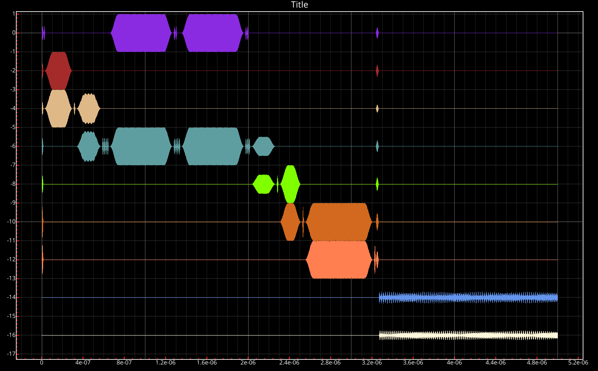

# **Introduction to QuarkCanvas**
### **How to start**
???+ example "start"
    ```bash
    # pip install quarkstudio (if not installed)
    # init or update: quark init/update --mode=studio
    quark canvas
    ```
### **Real-time Waveform**
{.center}