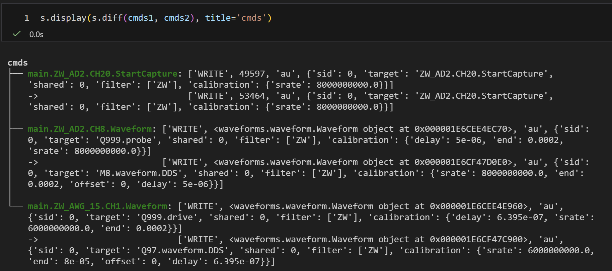
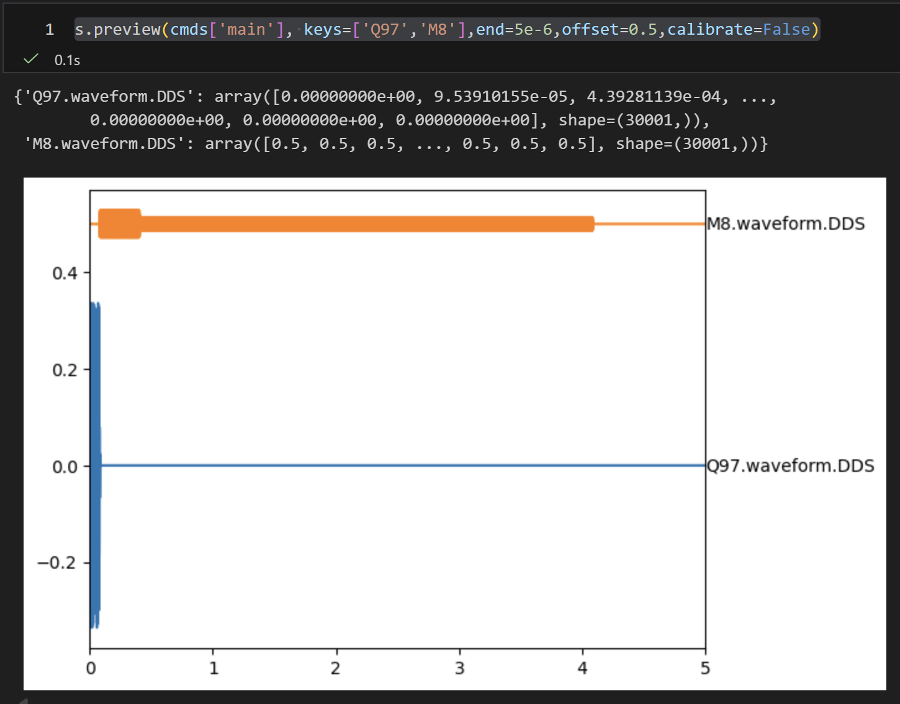

# 更新日志

???+ note "更新命令"
    ``` console
    $ quark udpate
    ```

<!-- 本日志遵循 [Keep a Changelog](https://keepachangelog.com/zh-CN/1.1.0/) 规范，   -->
<!-- 并采用 [语义化版本](https://semver.org/lang/zh-CN/)。 -->

<!-- ### ✨ 新增（Added）
- 新增 XXX 功能
- 支持 YYY 接口 / 模块

### 🔧 变更（Changed）
- 优化 ZZZ 算法性能
- 调整 API 返回字段结构

### 🐛 修复（Fixed）
- 修复在高并发情况下的崩溃问题
- 修复 Windows 环境下路径解析错误

### ⚠️ 废弃（Deprecated）
- 标记旧版 API `/v1/old-api` 为废弃 -->

---

### [**2026-02-11**] s.preview
- [🐛] 修复`s.read`因任务不存在导致的server停止问题
- [✨] `s.diff`新增ignore参数，用于忽略指定的key


### [**2026-02-10**] s.display
- [✨] 新增`s.display`接口，用于格式化打印字典或数据
- [✨] 新增`s.diff`接口，用于比较两个字典间差异，如不同cmds之间的差异


### [**2026-02-08**] s.preview
- [🐛] 修复`s.preview`波形显示接口，使其与`canvas`完全一致
- [🐛] 修复`init`初始化命令失效的问题


### [**2026-01-30**] canvas host
- [✨] 新增设置`etc.canvas.host`，可指定在另一台电脑画图
- [🐛] 修复`circuit`查询接口，即使编译失败时也可返回线路


### [**2026-01-27**] lib text
- [✨] 新增支持传递gates文件内容至server端，用于跨机传输gates库
- [✨] 新增采样函数`sample_waveform`，位于`gates`模块，如`u3`，默认每次reload


### [**2026-01-22**] sys info
- [✨] 新增**每次**server启动时，更新`usr.sysinfo`字段（记录python库版本信息）
- [✨] 新增采样函数`sample_waveform`以方便修改失真等逻辑(位于`glib/__init__.py`)
- [🔧] 更新`s`的`api`及对应的文档（见API Reference）
- [🐛] 修复`translate`表查询过程中默认值失效的bug
