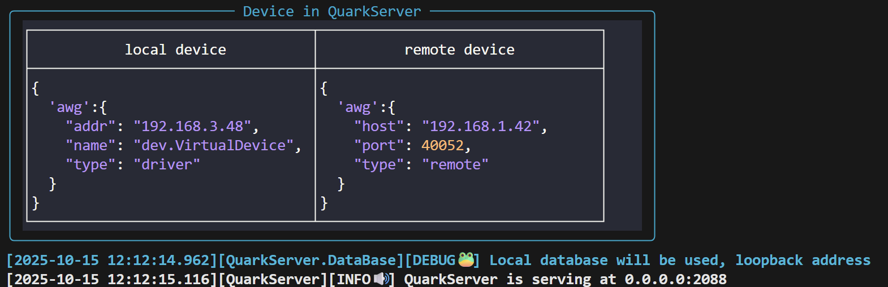

# **Introduction to QuarkServer**
### **How to start**
???+ example "start"
    ```bash
    # pip install quarkstudio[full] (if not installed)
    # quark update --server (if installed)
    quark server
    ```


### :material-server: ***QuarkServer***
<!-- !!! info "cfg表及kernel配置" -->

- Create folder **~/Desktop/home/cfg** and place the cfg file(e.g., [checkpoint.json](../code/checkpoint.json)) in it. 

- Run `quark server` in a terminal and you'll see the following information if everything is OK{.center}

- Once the `QuarkServer` is ready, run `quark studio` in another termnal. Click `Signup` and fill the username and system name(i.e., the cfg file name `checkpoint`) in the corresponding blanks and click `sign up`.{.center}
    :material-information: equaivalent operations in Python code
    ```python
    from quark.app import signup
    signup('baqis', 'checkpoint') # (username, cfg file name)
    ```

- Fill the username and password in the Login window。{.center}
<!-- - Fill in the following content into the configuration file for kernel and place it in `systemq/etc/bootstrap.json`
```python
{
    "executor": {
        "type": "quark",
        "host": "127.0.0.1", # host computer's IP address
        "port": 2088
    },
    "data": { # settings of data storage 
        "path": "",
        "url": ""
    },
    "repo": { # systemq location
        "systemq": "C:\\systemq\\"
    }
}
```
    :warning: ***kernel login to the server with `baqis` as the default username(see `kernel.sched.executor.QuarkClient.connect`)*** -->

### :material-frequently-asked-questions: ***FAQ***
<!-- !!! question "cfg表常见问题" -->
#### :material-cloud-question: cfg structure？

:material-message-reply: server accept `json`(see ***checkpoint*** above) as input and there is no restriction on the file content. Traditionally, the cfg file includes user-defined fields(qubits, couplers, gates and so on) and system-defined fields(**etc**, **dev**)

#### :material-cloud-question: what is dev？

:material-message-reply: **dev** stores device information
```python
{
    "dev": {
        'awg':{ # alias of the device
            "addr": "192.168.3.48", # IP address of the device
            "name": "VirtualDevice", # filename of the driver
            "srate": 1000000000.0, # sampling rate(defined by the srate attribute in the driver class)
            "type": "driver", # connection type, driver or remote
            "host": "useless", # IP address of the host computer(required only if the type is remote)
            "port": "useless" # service port(required only if the type is remote)
        }
}
```

#### :material-cloud-question: what is etc？

:material-message-reply: **etc** mainly includes some global settings, such as the MAPPING
```python
{
    "etc": {
        "driver": {
            "path": "dev", # driver path relative to systemq
            "concurrent": True, # open device concurrently if True
            "timeout": 30.0, # device execution timeout
            "filter": ["send Waveform or np.array to device in the list"],
            "mapping": { # mapping between logical channel and hardware channel
                "setting_LO": "LO.Frequency", # see driver for more details about device attributes
                "setting_POW": "LO.Power",
                "setting_OFFSET": "ZBIAS.Offset",
                "waveform_RF_I": "I.Waveform",
                "waveform_RF_Q": "Q.Waveform",
                "waveform_TRIG": "TRIG.Marker1",
                "waveform_DDS": "DDS.Waveform",
                "waveform_SW": "SW.Marker1",
                "waveform_Z": "Z.Waveform",
                "setting_PNT": "ADC.PointNumber",
                "setting_SHOT": "ADC.Shot",
                "setting_TRIGD": "ADC.TriggerDelay"
            },
            "root": "~/Desktop/systemq" # systemq location
        },
        "server": {
            "workers": 1, # number of compilation processes
            "shared": 0,
            "delay": 10.0, # maximum delay(in the unit of second) for feed
            "cached": 5, # number of cached task
            "review": [0, 1, 10], # index of cached step
            "schedule": {
                "job": {
                    "hour": "2"
                }
            },
            "filesize": 4000.0 # maximum size of an hdf5 file
        },
        "canvas": {
            "range": [0, 0.0001], # time range in QuarkCanvas
            "filter": [] # targets to be displayed in QuarkCanvas
        }
    }
}
```