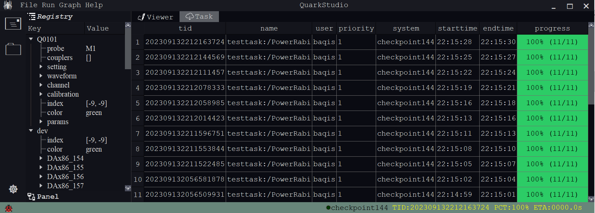
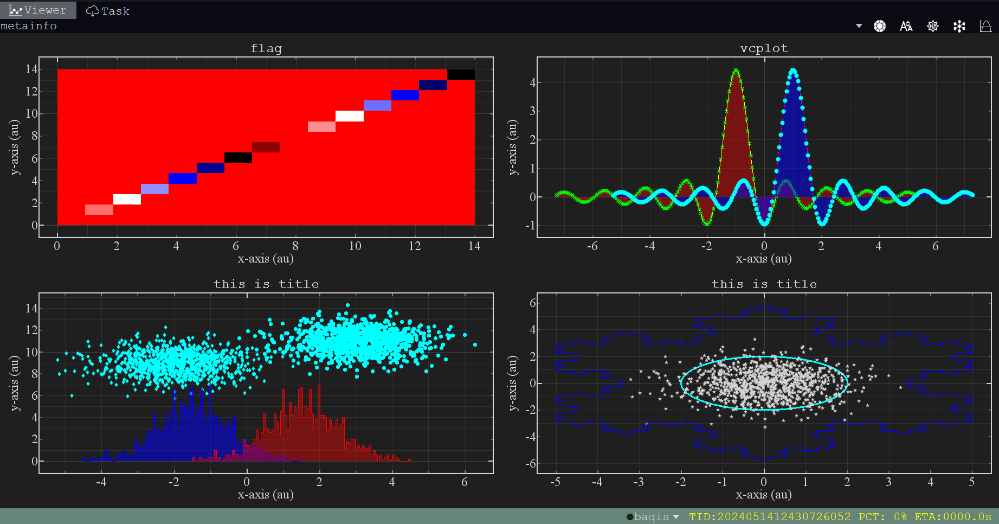
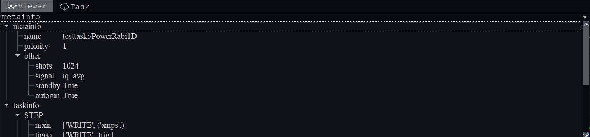
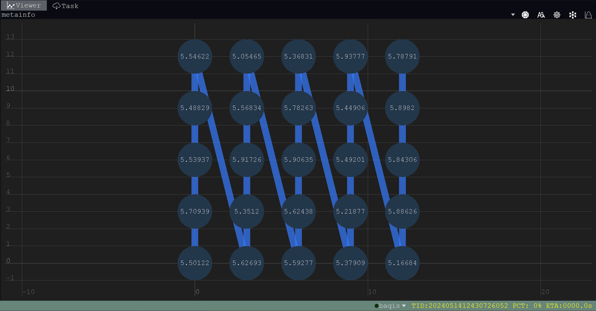

# **Introduction to QuarkStudio**
### **How to start**
???+ example "start"
    ```bash
    # pip install quarkstudio[full] (if not installed)
    # quark update --mode=studio (if installed)
    quark studio
    ```
### **Parameters and Tasks**
{.center}

### **Data Visualization**
{.center}

### **Task Description**
{.center}

### **Topological Structure**
{.center}
