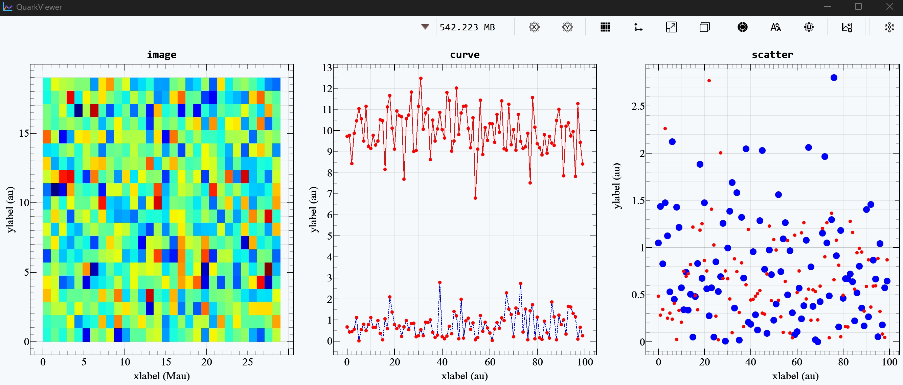

# **Introduction to QuarkViewer**
### **How to start**
???+ example "start"
    ```bash
    # pip install quarkstudio[full] (if not installed)
    # quark update --studio (if installed)
    quark viewer
    ```
### **Data Visualization**
{.center}

:material-information: Plotting example
```python
import numpy as np

from quark.app import s

with s.fig() as fig:
    axes = fig.subplot(3)
    axes[0].imshow(np.random.randn(30, 20),
                   xdata=np.arange(30) * 1e6,
                   ydata=np.arange(20),
                   colormap='jet',
                   title='image')

    axes[1].plot(np.random.randn(100),
                 xdata=np.arange(100),
                 linestyle='-.',
                 linecolor='b',
                 markersize=5,
                 xlabel='xx',
                 ylabel='yyy')
    axes[1].plot(np.random.randn(100) + 10,
                 xdata=np.arange(100),
                 title='curve')

    axes[2].scatter(np.random.randn(100),
                    xdata=np.arange(100),
                    markercolor='b',
                    markersize=10)
    axes[2].scatter(np.random.randn(100),
                    xdata=np.arange(100),
                    markercolor='r',
                    markersize=5,
                    title='scatter')
```