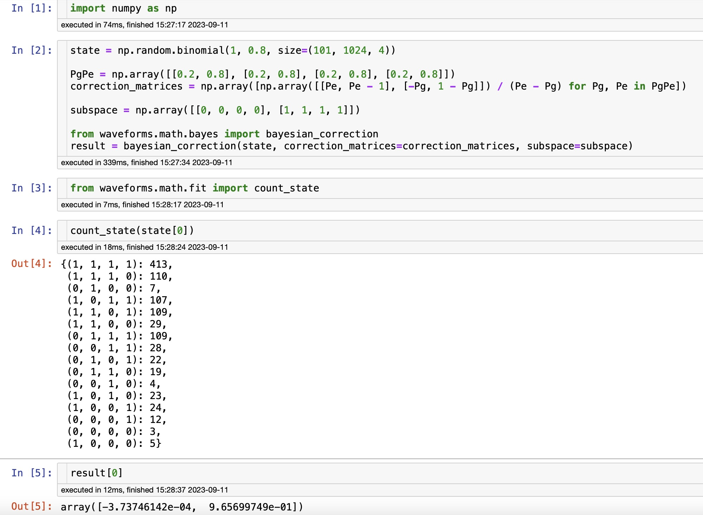
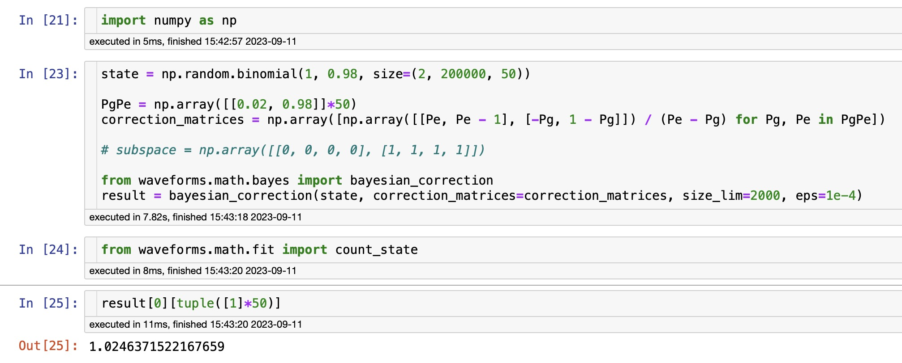
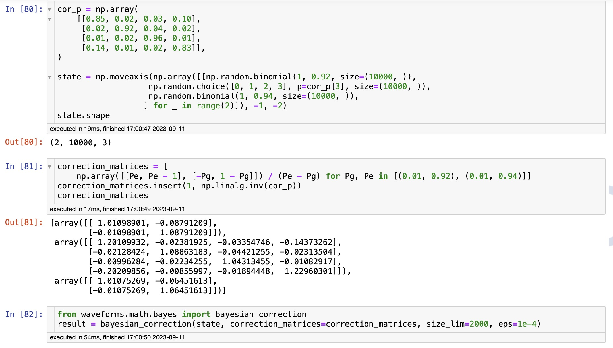
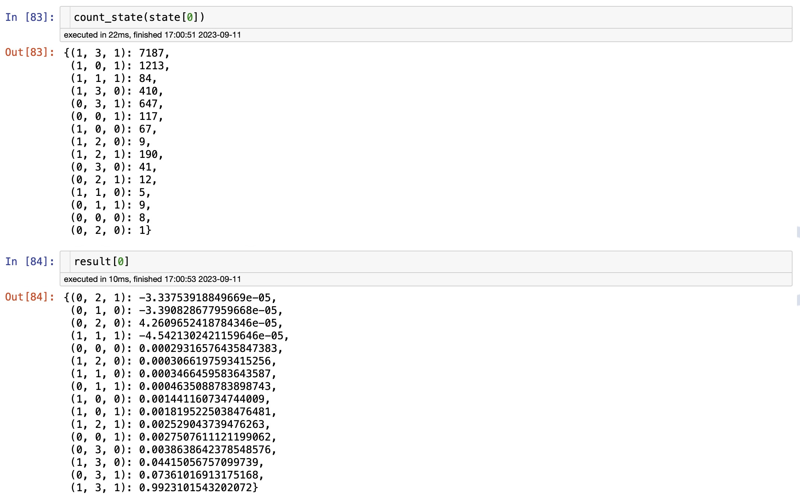
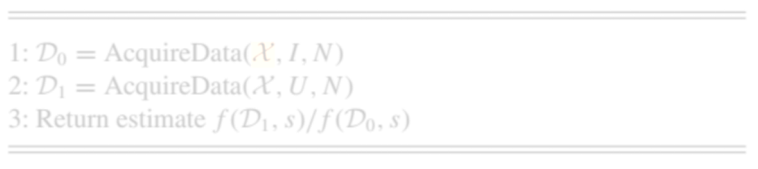
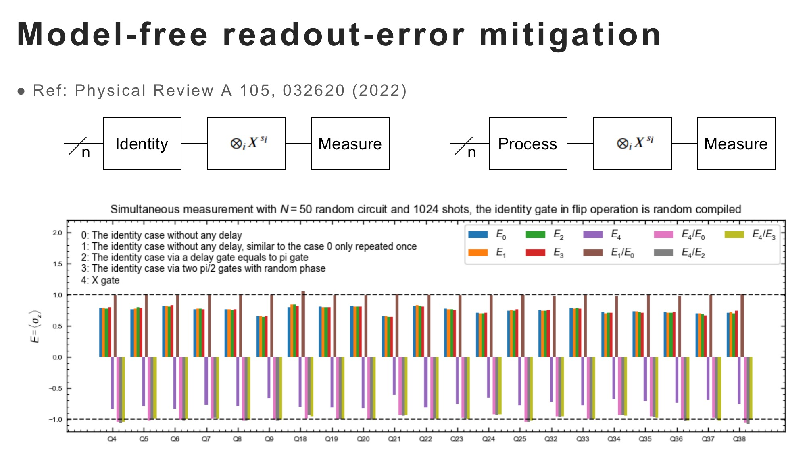
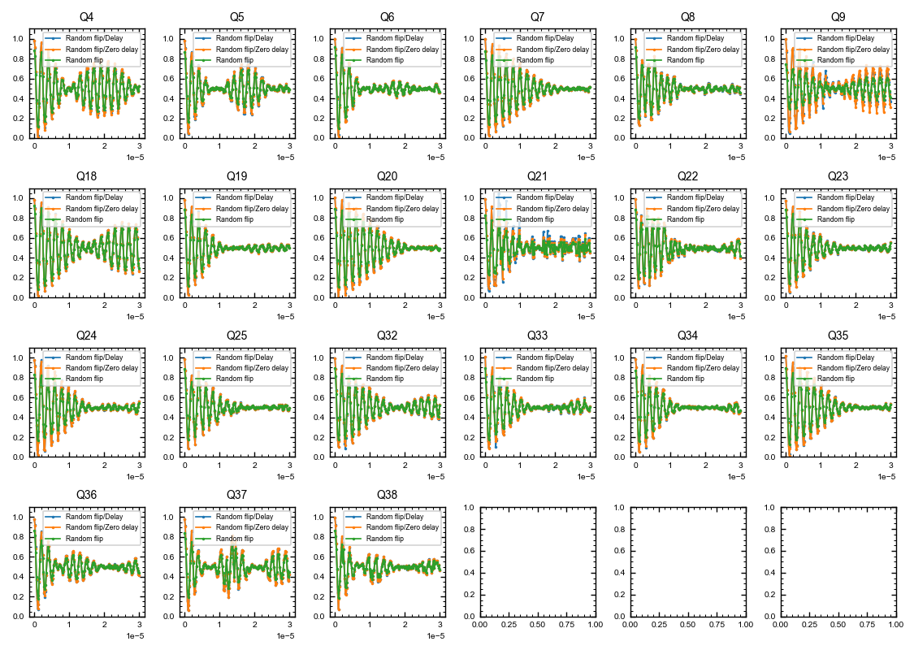

# Bayesian Correction of Measure Results
***LP by 2023***

The Bayes rule,
$P(A_i|B)=\frac{P(B|A_i)P(A_i)}{\sum_j P(B|A_j)P(A_j)}$
is the basis for the following discussion to reduce the classic errors in measurements.

## The simple case for one qubit

For one qubit,
it is obvious that
$\begin{aligned}
\begin{pmatrix}P(\text{measure }|0\rangle)\\P(\text{measure }|1\rangle)\end{pmatrix}&=
\begin{pmatrix}
P(\text{measure }|0\rangle|\text{prepare }|0\rangle)&
P(\text{measure }|0\rangle|\text{prepare }|1\rangle)\\
P(\text{measure }|1\rangle|\text{prepare }|0\rangle)&
P(\text{measure }|1\rangle|\text{prepare }|1\rangle)
\end{pmatrix}
\begin{pmatrix}P(\text{prepare }|0\rangle)\\P(\text{prepare }|1\rangle)\end{pmatrix}\\
&={M}\begin{pmatrix}P(\text{prepare }|0\rangle)\\P(\text{prepare }|1\rangle)\end{pmatrix}.
\end{aligned}$
The elements of $M$ can be extracted from prior expriments,
such as

1. The qubit is prepared in the ground state and then measured with the probability $P(\text{measure }|0\rangle|\text{prepare }|0\rangle)$ in the ground state the $P(\text{measure }|1\rangle|\text{prepare }|0\rangle)$ in the first excited state.
2. Then the qubit is prepared in the first excited state and measured with the probability $P(\text{measure }|0\rangle|\text{prepare }|1\rangle)$ in the ground state the $P(\text{measure }|1\rangle|\text{prepare }|1\rangle)$ in the first excited state.

With the correction matrix $M^{-1}$,
results from any other circuit can be processed by
${M}^{-1}\begin{pmatrix}P(\text{measure }|0\rangle)\\P(\text{measure }|1\rangle)\end{pmatrix}=\begin{pmatrix}P(\text{prepare }|0\rangle)\\P(\text{prepare }|1\rangle)\end{pmatrix}
=\begin{pmatrix}
P(\text{the ideal measurement result will be }|0\rangle)\\
P(\text{the ideal measurement result will be }|1\rangle)\end{pmatrix}$
Attention to that the errors in preparation is ignored.

## Naive case for more qubits
For $N$ qubits,
the basis state can be expressed by
$|k\rangle\equiv|a_0\rangle\otimes|a_1\rangle\otimes\cdots\otimes|a_{N-1}\rangle$

with $(a_0a_1\cdots a_{N-1})_2$ is the binary representation of $k$,
i.e.
$k=\sum_{j=0}^{N-1}a_j\cdot2^{N-1-j}=(a_0a_1\cdots a_{N-1})_2$

Thereore,
$\begin{aligned}
P(\text{the ideal measurement result will be }|k\rangle)
&=\sum_{l=0}^{2^N-1}P(\text{prepare }|k\rangle|\text{measure }|l\rangle)P(\text{measure }|l\rangle)\\
&=\sum_{l=0}^{2^N-1}(M^{-1})_{k, l}P(\text{measure }|l\rangle).
\end{aligned}$

The elements of correction matrix $M^{-1}$ can also be extracted from prior expriments,
and the step to determine $P(\text{measure }|k\rangle|\text{prepare }|l\rangle)$ is similar to the one qubit case.

However,
the complexity to obtain readout correction matrix and the dimension of readout correction matrix grow exponentially as the qubit number $N$ increases,
so that the naive method is almost impossible accomplished when $N\sim20$.

## If the correlations in measurements can be ignored

Usually,
the measurement correlations between diffirent qubits can be ignored,
i.e.
$P(\text{prepare }|k\rangle|\text{measure }|l\rangle)=\prod_{j=0}^{N-1}P(\text{prepare }|a_j\cdot2^{N-1-j}\rangle|\text{measure }|b_j\cdot2^{N-1-j}\rangle)$
with $k=(a_0a_1\cdots a_{N-1})_2$ and $l=(b_0b_1\cdots b_{N-1})_2$.
Therefore the correction takes the form
${M}^{-1}=\otimes_{j=0}^{N-1}{M}_j^{-1}={M}_0^{-1}\otimes{M}_1^{-1}\otimes\cdots\otimes{M}_{N-1}^{-1}$

Based on this assumption,
the calculation process will be simplified.
Here are two classical situations for reference.

### The ideal states in results are known

In this case, 
only some of the states need to be observed and these states are determined.
Actually the corrections only need to be done in partial space,
leading to a simplification in correct process.

In python such process can be quick calculated by `waveforms.math.bayes.bayesian_correction`,
for example
```python
state = np.random.binomial(1, 0.8, size=(101, 1024, 4))
# generate a random result for test, the last dimension is the number of measured qubits, the penultimate dimension is the number of shots
# only the last two dimensions are important

PgPe = np.array([[0.2, 0.8], [0.2, 0.8], [0.2, 0.8], [0.2, 0.8]])
correction_matrices = np.array([np.array([[Pe, Pe - 1], [-Pg, 1 - Pg]]) / (Pe - Pg) for Pg, Pe in PgPe])
# generate correction matrices for the four qubits respectively

# subspace = np.array([[1, 0, 0, 0], [0, 1, 0, 0], [0, 0, 1, 0], [0, 0, 0, 1], [1, 1, 0, 0]])
subspace = np.array([[0, 0, 0, 0], [1, 1, 1, 1]])
# specify the state that needs to be concerned

from waveforms.math.bayes import bayesian_correction
result = bayesian_correction(state, correction_matrices=correction_matrices, subspace=subspace)
```

Then the `result.shape` is `(101, 5)`,
which is corresponding to the item in `subspace`.



### The states with high probability are concerned

In this case,
only some states with high probability appearing in the ideal measurement results are considered.
And,
another fact is that the readout error is relative small in a well-calibrated system,
i.e. $P(\text{measure }|k\rangle|\text{prepare }|k\rangle)\gg P(\text{measure }|l\rangle|\text{prepare }|k\rangle), l\neq k$.
This allows for some algorithmic optimization.

For a state $|l\rangle$ with the probability $P(\text{measure }|l\rangle)$ in the original measurement result,
it generally contributes to all of the $2^N$ states.
But from the first assumption,
the magnitude of the influence can be sorted within the complexity $\mathcal O(N\log N)$ and it decreases rapidly. If the influences are considered in the decreasing order and the current one is small enough, all of remains which are no larger than the current one can be dropped. The second assumption restricts the size of the state to be considered and what is small enough.
If the number of considered set is $S$,
the complexity is about $\mathcal O(S\log S)$ with proper data structure.
Because a total of $R$ shots are applied,
the complexity can be roughly estimated as $\mathcal O(RN\log N+RS\log S)\approx\mathcal O(RS\log S)$.

It's worth noting that some tiny value are dropped and actually this algorithm is an approximation algorithm.
Meanwhile the considering order of diffirent shots has an effect on the efficiency.

In python such process can also be quick calculated by `waveforms.math.bayes.bayesian_correction`,
based on the Fibonacci heap.
The full parameters of `waveforms.math.bayes.bayesian_correction` are
```python
'''
bayesian_correction(state, correction_matrices, *, subspace=None, size_lim=1024, eps=1e-06)
    Apply a correction matrix to a state.
    
    Args:
        state (np.array, dtype=int): The state to be corrected.
        correction_matrices (np.array): A list of correction matrices.
        subspace (np.array, dtype=int): The basis of subspace.
        size_lim (int): The maximum size of the heap, relative to the number of consider states.
        eps (float): The minimum probability of the state.
    
    Returns:
        np.array: The corrected state or counts.
'''
```

So that 
```python
result = bayesian_correction(state, correction_matrices, size_lim=2000, eps=1e-5)
# calculate the correction reuslt, subspace is None
```




> 建议做一个参数控制，控制传入的参数是`states`还是`counts`.


### 部分关联的情况

此时部分比特发生了局域的关联，但局域没有交叉，此时也可以用局域bayes修正，例如，






# 随机线路方案






```python
import numpy as np


def maskints_to_masks(maskints, N, reverse=True):
    ret = []
    for maskint in maskints:
        bits_order = range(0, N) if reverse else range(N-1, -1, -1)
        for i in bits_order:
            ret.append((maskint>>i)%2)
    return np.array(ret, dtype=np.uint8).reshape([-1, N])


def counts_to_states(counts, masks):
    ret = []
    for i, mask in enumerate(masks):
        for k, v in counts[i].items():
            ret.extend([np.array(k, dtype=np.uint8)^mask]*v)
    return np.asarray(ret)


def counts_update(counts, masks):
    ret = []
    for i, mask in enumerate(masks):
        tmp = {}
        for k, v in counts[i].items():
            tmp[tuple(np.array(k, dtype=np.uint8)^mask)] = v
        ret.append(tmp)
    return np.asarray(ret)


masks = maskints_to_masks(result['seeds'], len(qubits))
count = counts_to_states(result[signal], masks)
```

