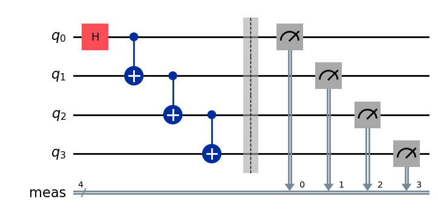
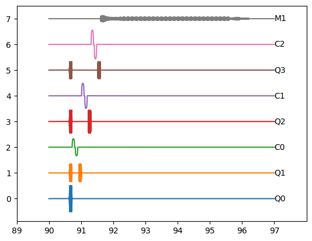

# qlisp syntax

## **quantum circuit**


Write the above quantum circuit in QLisp form


```python
circuit = [
    ('H', 'Q0'),
    ('Cnot', ('Q0', 'Q1')),
    ('Cnot', ('Q1', 'Q2')),
    ('Cnot', ('Q2', 'Q3')),
    ('Barrier', ('Q0', 'Q1', 'Q2', 'Q3')),
    (('Measure', 0), 'Q0'),
    (('Measure', 1), 'Q1'),
    (('Measure', 2), 'Q2'),
    (('Measure', 3), 'Q3'),
]
```
## **waveform sequence**

The corresponding waveform sequence will be generated as follows




## **basic gate**

| statement | gate | matrix | Description |
|:---------:|:----:|:------:|:-----------:|
|`('I', 'Q0')`|  $I$   | $\begin{pmatrix}1 & 0\\0 & 1\end{pmatrix}$ | |
|`('X', 'Q0')`|  $\sigma_x$   | $\begin{pmatrix}0 & 1\\1 & 0\end{pmatrix}$ | |
|`('Y', 'Q0')`|  $\sigma_y$   | $\begin{pmatrix}0 & -i\\i & 0\end{pmatrix}$ | |
|`('Z', 'Q0')`|  $\sigma_z$   | $\begin{pmatrix}1 & 0\\0 & -1\end{pmatrix}$ | |
|`('H', 'Q0')`|  $H$   | $\frac{1}{\sqrt{2}}\begin{pmatrix}1 & 1\\1 & -1\end{pmatrix}$ | |
|`('S', 'Q0')`|  $S$   | $\begin{pmatrix}1 & 0\\0 & i\end{pmatrix}$ | |
|`('-S', 'Q0')`|  $S^{\dagger}$   | $\begin{pmatrix}1 & 0\\0 & -i\end{pmatrix}$ | |
|`('T', 'Q0')`|  $T$   | $\begin{pmatrix}1 & 0\\0 & e^{i\pi/4}\end{pmatrix}$ | |
|`('-T', 'Q0')`|  $T^{\dagger}$   | $\begin{pmatrix}1 & 0\\0 & e^{-i\pi/4}\end{pmatrix}$ | |
|`(('Rx', theta), 'Q0')`|  $R_x(\theta)$   | $\exp\left(-i\frac{\theta}{2}\sigma_x\right)$ | |
|`(('Ry', theta), 'Q0'`|  $R_y(\theta)$   | $\exp\left(-i\frac{\theta}{2}\sigma_y\right)$ | |
|`(('Rz', phi), 'Q0')`|  $R_z(\theta)$   | $\exp\left(-i\frac{\phi}{2}\sigma_z\right)$ | |
|`('X/2', 'Q0')`|  $R_x(\pi/2)$   | $\exp\left(-i\frac{\pi}{4}\sigma_x\right)$ | |
|`('-X/2', 'Q0')`|  $R_x(-\pi/2)$   | $\exp\left(i\frac{\pi}{4}\sigma_x\right)$ | |
|`('Y/2', 'Q0')`|  $R_y(\pi/2)$   | $\exp\left(-i\frac{\pi}{4}\sigma_y\right)$ | |
|`('-Y/2', 'Q0')`|  $R_y(-\pi/2)$   | $\exp\left(i\frac{\pi}{4}\sigma_y\right)$ | |
|`('iSWAP', ('Q0', 'Q1'))`|  $i\mathrm{SWAP}$   | $\begin{pmatrix}1&0&0&0\\0&0&i&0\\0&i&0&0\\0&0&0&1\end{pmatrix}$ | |
|`('Cnot', ('Q0', 'Q1'))`|  $Cnot$   | $\begin{pmatrix}1&0&0&0\\0&1&0&0\\0&0&0&1\\0&0&1&0\end{pmatrix}$ | |
