# Waveforms

```python
%matplotlib notebook
import matplotlib.pyplot as plt
import numpy as np
from waveforms import *
```

## basic operation

### time shift

```python
t = np.linspace(-100, 100, 10001)

wav1 = gaussian(40)
wav2 = wav1 >> 50
wav3 = wav1 << 50

plt.plot(t, wav1(t), label='wav1')
plt.plot(t, wav2(t), label='wav2')
plt.plot(t, wav3(t), label='wav3')
plt.legend()
plt.show()
```

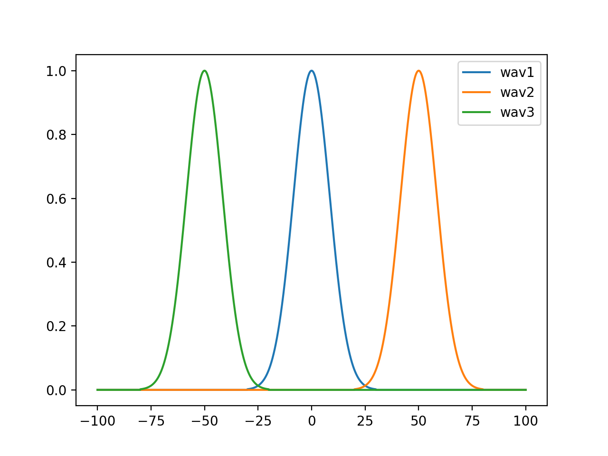

### + - * /

```python
t = np.linspace(-100, 100, 10001)

wav1 = gaussian(40) * square(30) - 1
wav2 = wav1 >> 50
wav3 = wav1 << 50

w1 = wav1 + wav2
w2 = wav2 - wav3

plt.plot(t, w1(t), label='wav1 + wav2')
plt.plot(t, w2(t), label='wav2 - wav3')
plt.legend()
plt.show()
```

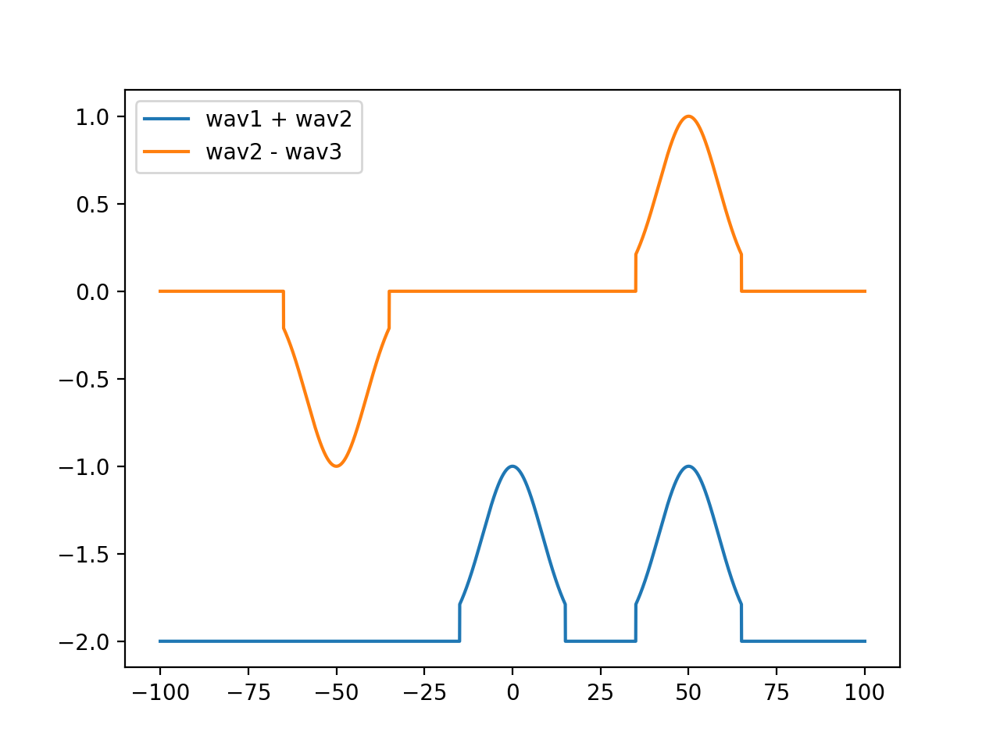

```python
t = np.linspace(-100, 100, 10001)

w1 = 0.5 * square(40) * cos(1) + 1
w2 = cosPulse(40) / 2

plt.plot(t, w1(t), label='w1')
plt.plot(t, w2(t), label='w2')
plt.legend()
plt.show()
```

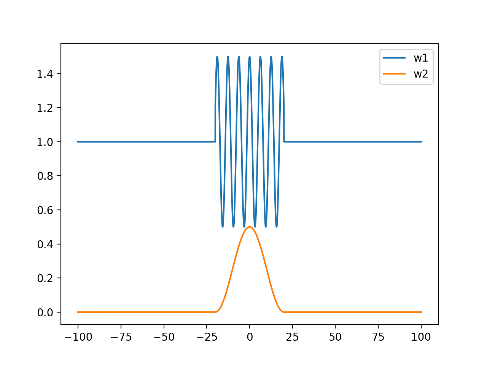

### compare

```python
w1 = gaussian(10)
w2 = w1 >> 12
w3 = 0.5 * w2

w1 - 2 * (w3 << 12) == 0
```

### derivative

```python
x = np.linspace(-10,10,1001)

w = (gaussian(8) >> 1)
dw = D(w)

plt.plot(x, w(x), label='f')
plt.plot(x, dw(x), label='df/dt')
plt.legend()
```

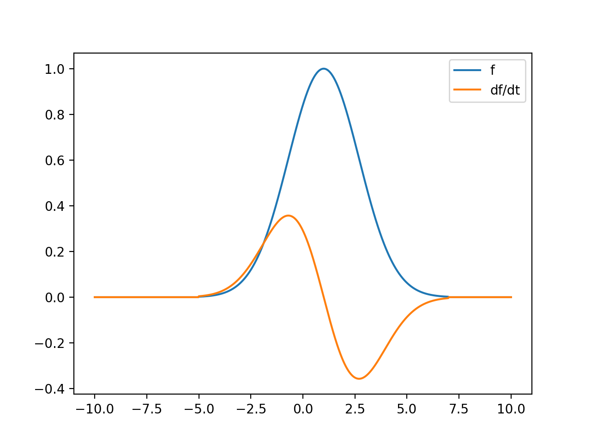

### cut

```python
x = np.linspace(-10,10,1001)

w = gaussian(10)
cw = cut(w, start=-2, stop=3)
cw2 = cut(w, start=-2, stop=3, head=0)
cw3 = cut(w, start=-2, stop=3, tail=0)
cw4 = cut(w, max=0.75)

plt.subplot(211)
plt.plot(x, w(x), label='f')
plt.plot(x, cw(x), label='cut(f)')
plt.plot(x, cw2(x), label='cut(f, head=0)')
plt.plot(x, cw3(x), label='cut(f, tail=0)')
plt.plot(x, cw4(x), label='cut(f, max=0.75)')

plt.legend()

w = sin(10)
cw = cut(w, start=-2, stop=3)
cw2 = cut(w, start=-2, stop=3, min=0)

plt.subplot(212)
plt.plot(x, w(x), label='f')
plt.plot(x, cw(x)-4, label='cut(f) - 4')
plt.plot(x, cw2(x)-8, label='cut(f, min=0) - 8')
plt.legend()
```

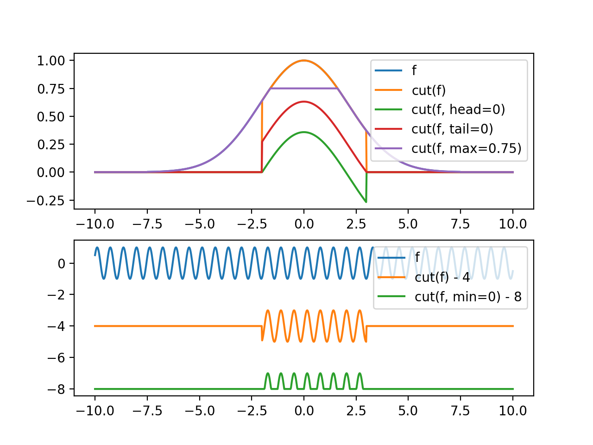

## mixing

### up conversion

```python
I = gaussian(100) * cos(2*pi*0.1)
Q = gaussian(100) * sin(2*pi*0.1)

plt.plot(t, I(t), label='I')
plt.plot(t, Q(t), label='Q')
plt.legend()
plt.show()
```

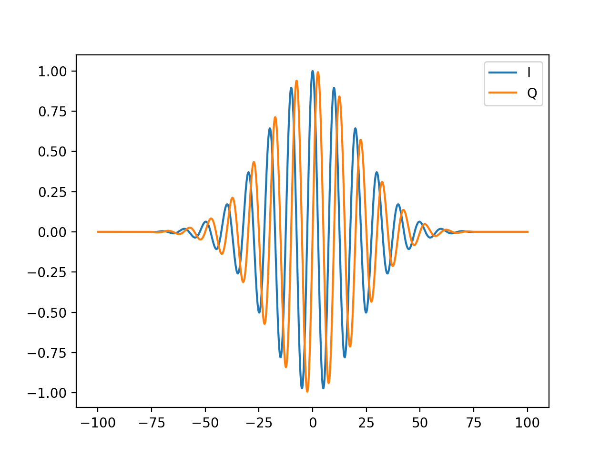

```python
I, Q = mixing(gaussian(100), freq=0.1, phase=0, DRAGScaling=0.2)

plt.plot(t, I(t)+1, label='I')
plt.plot(t, Q(t)+1, label='Q')

I, Q = mixing(gaussian(100), freq=0.1, phase=1, DRAGScaling=0.2)

plt.plot(t, I(t)-1, label='I phase=1')
plt.plot(t, Q(t)-1, label='Q phase=1')
plt.legend()
plt.show()
```

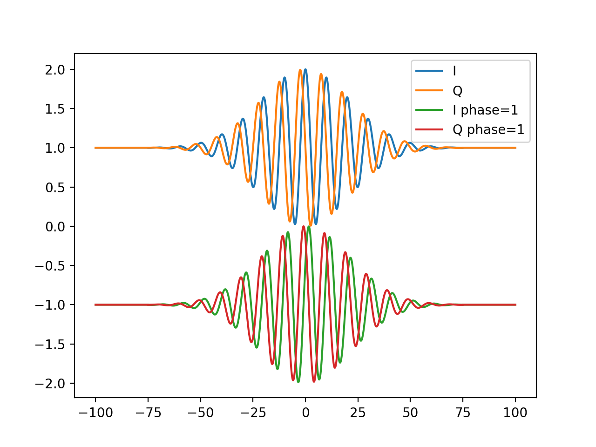

### down conversion

```python
rf, _ = mixing(gaussian(100), freq=92.0451, phase=0.32, DRAGScaling=0.0)

plt.plot(t, rf(t), label='rf', alpha=0.4)

lofreq = 92

I = (2 * rf * cos(-2 * pi * lofreq))
I = I.filter(high=2 * pi * lofreq)
plt.plot(t, I(t), label='I')

Q = (2 * rf * sin(-2 * pi * lofreq))
Q = Q.filter(high=2 * pi * lofreq)
plt.plot(t, Q(t), label='Q')

plt.legend()
plt.show()
```

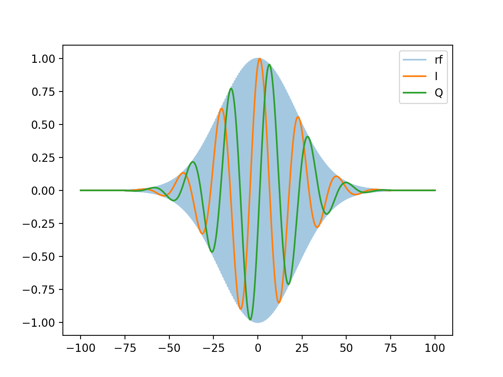

## basic waveforms

### DC

```python
x = np.linspace(-10,10,1001)

w1 = zero()
w2 = one()
w3 = const(0.4)

plt.plot(x, w1(x))
plt.plot(x, w2(x))
plt.plot(x, w3(x))
```

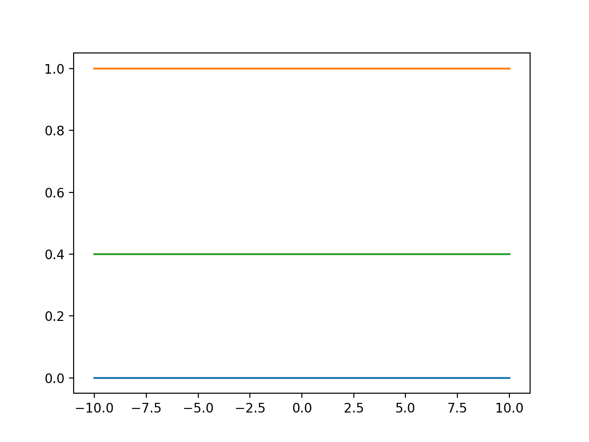

### gaussian


```python
x = np.linspace(-10,10,1001)

w = gaussian(8)
dw = D(w)

plt.subplot(211)
plt.plot(x, w(x))
plt.plot(x, dw(x))

w = cosPulse(8)
dw = D(w)

plt.subplot(212)
plt.plot(x, w(x))
plt.plot(x, dw(x))
```

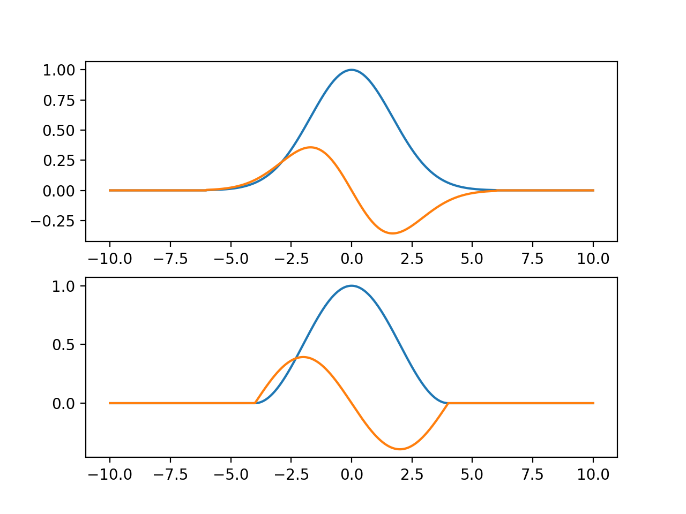


### sine


```python
x = np.linspace(-10,10,1001)

w1 = sin(1)
w2 = cos(1)
w3 = cos(1, phi=1.2)

plt.plot(x, w1(x))
plt.plot(x, w2(x))
plt.plot(x, w3(x))
```

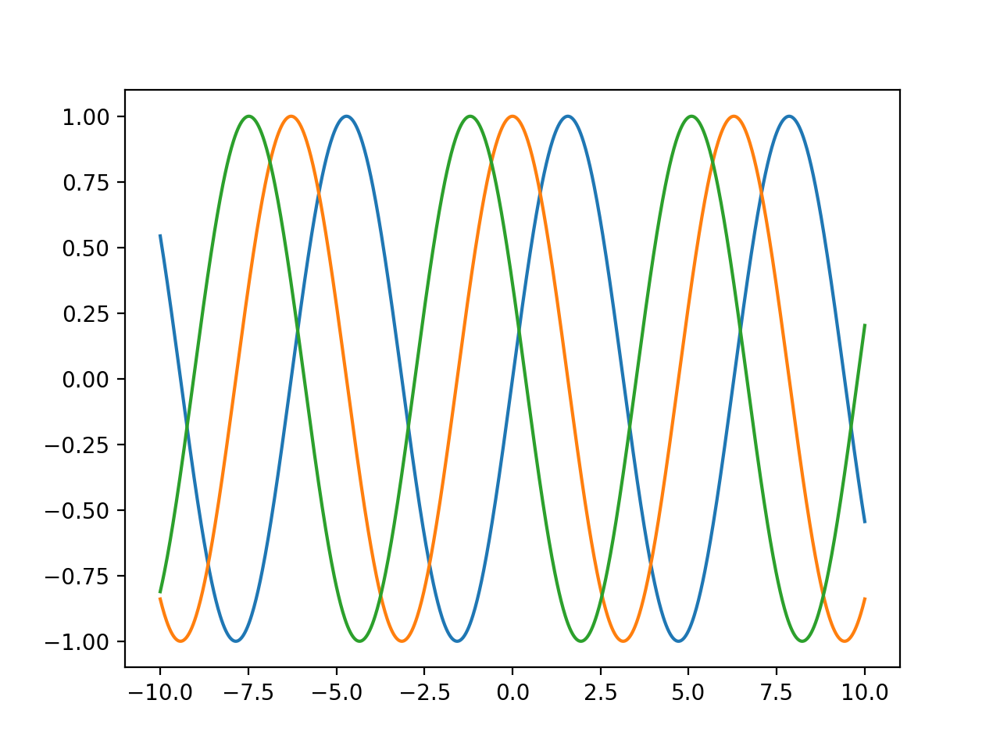


### square


```python
x = np.linspace(-10,10,1001)

w1 = square(10)
w2 = square(10, edge=3)
w3 = square(10, edge=3, type='linear')
w4 = square(10, edge=3, type='cos')

plt.plot(x, w1(x)+2)
plt.plot(x, w2(x))
plt.plot(x, w3(x)-2)
plt.plot(x, w4(x)-4)
```

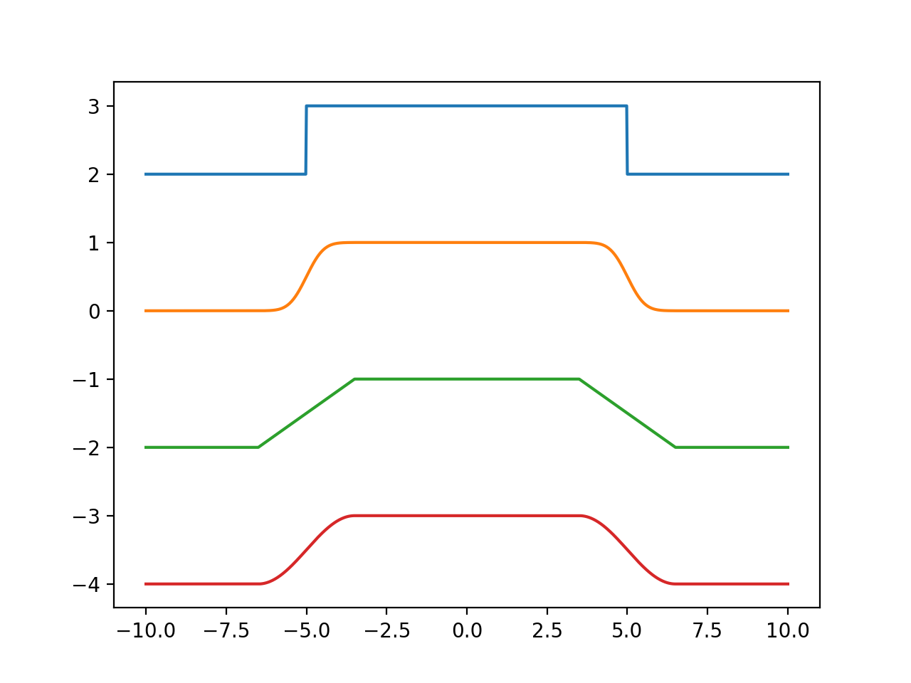


### step


```python
x = np.linspace(-10,10,1001)

w1 = step(0)
w2 = step(edge=3)
w3 = step(edge=3, type='linear')
w4 = step(edge=3, type='cos')

plt.plot(x, w1(x)+2)
plt.plot(x, w2(x))
plt.plot(x, w3(x)-2)
plt.plot(x, w4(x)-4)
```

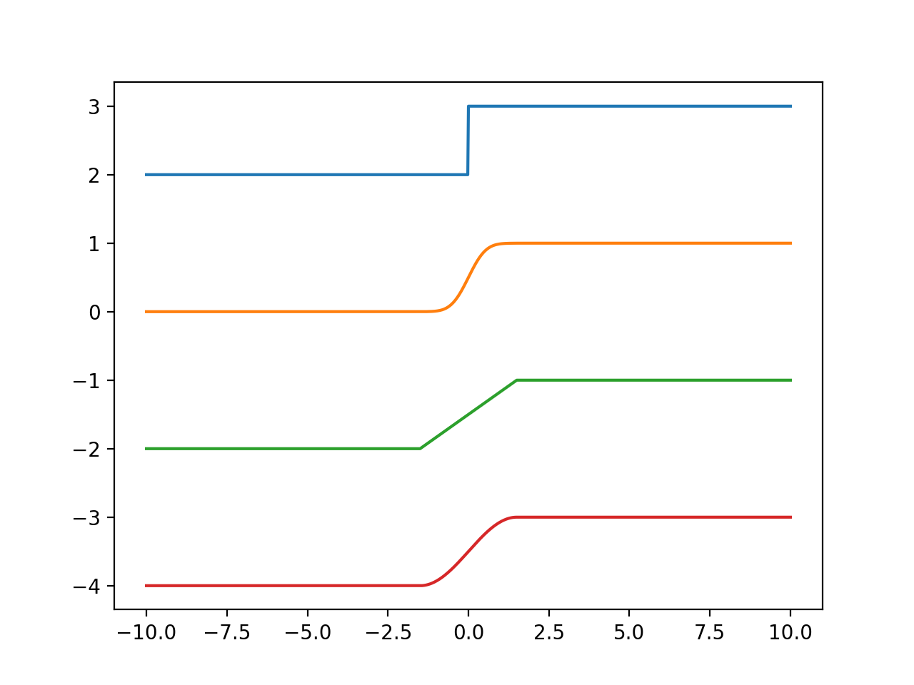

### poly


```python
x = np.linspace(-10,10,1001)
w = poly([1, -2, 0.5, 0.1])

plt.plot(x, w(x))
```

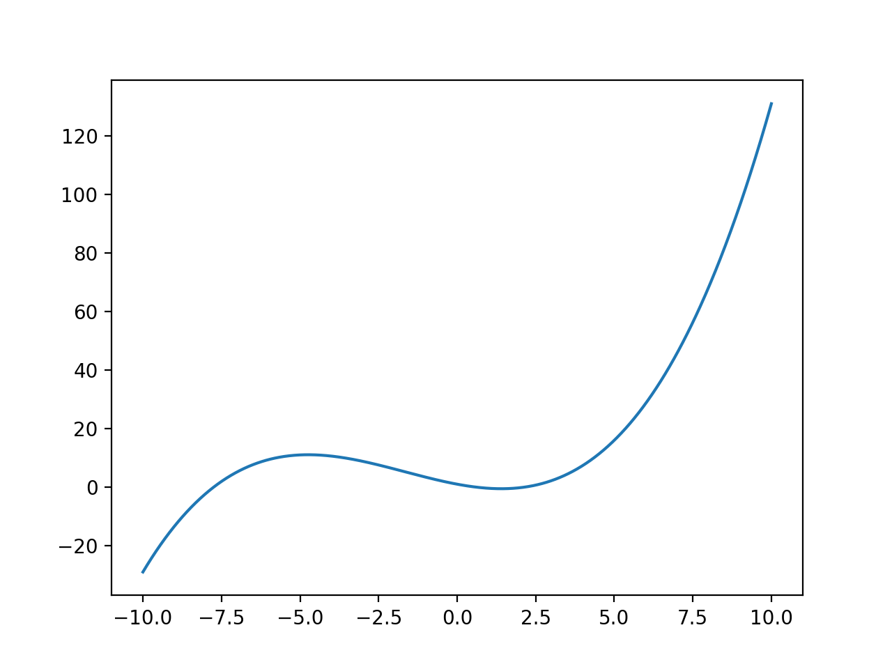


### exp and sinc


```python
plt.subplot(211)
x = np.linspace(0,10,1001)
w = exp(alpha=-1)
plt.plot(x, w(x))

plt.subplot(212)
x = np.linspace(-10,10,1001)
w = sinc(bw=1)
plt.plot(x, w(x))
```

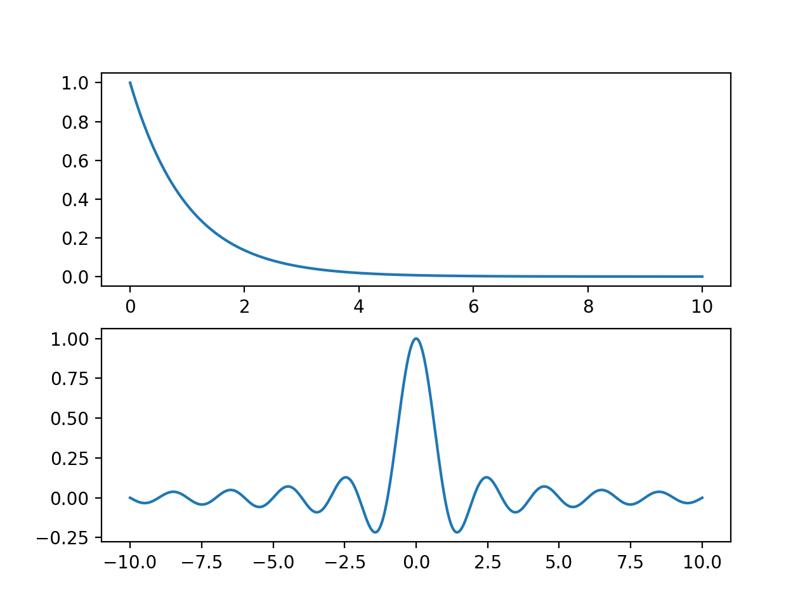


### interp

When the number of interpolation segments is too high, it may lead to decreased performance.


```python
x = np.linspace(-10, 10, 1001)
w = interp(x=[-5, -3, -3, 0, 2, 4], y=[1, 2, -1, -1, 1, 0])
plt.plot(x, w(x))

w = w * sin(20)
plt.plot(x, w(x))
```

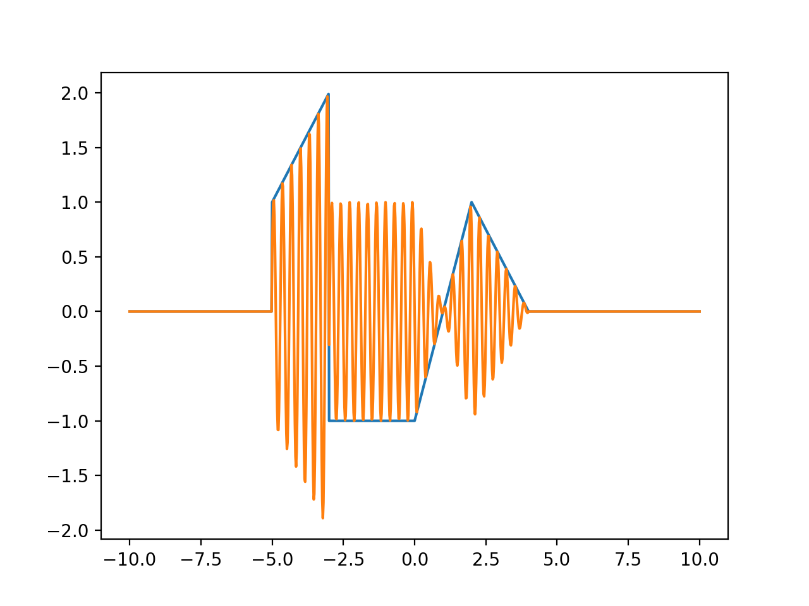


### parser


```python
w1 = wave_eval("(gaussian(12) >> 3) * cos(16.2, 1.63) + 0.5*(gaussian(12) >> 35) * cos(16.2, 2)")
w2 = (gaussian(12) >> 3) * cos(16.2, 1.63) + 0.5*(gaussian(12) >> 35) * cos(16.2, 2)

x = np.linspace(-10, 50, 10001)

plt.plot(x, w1(x))
plt.plot(x, w2(x))


w1 == w2
```

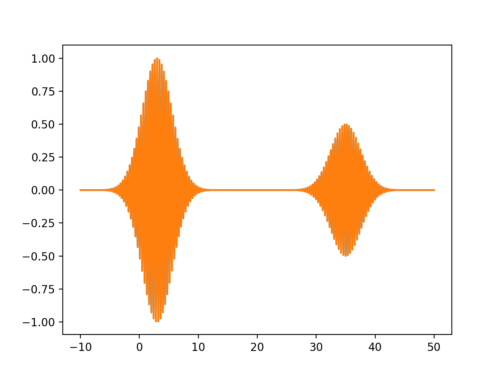

