# Waveforms

```python
%matplotlib notebook
import matplotlib.pyplot as plt
import numpy as np
from waveforms import *
```

## basic operation

### time shift

```python
t = np.linspace(-100, 100, 10001)

wav1 = gaussian(40)
wav2 = wav1 >> 50
wav3 = wav1 << 50

plt.plot(t, wav1(t), label='wav1')
plt.plot(t, wav2(t), label='wav2')
plt.plot(t, wav3(t), label='wav3')
plt.legend()
plt.show()
```

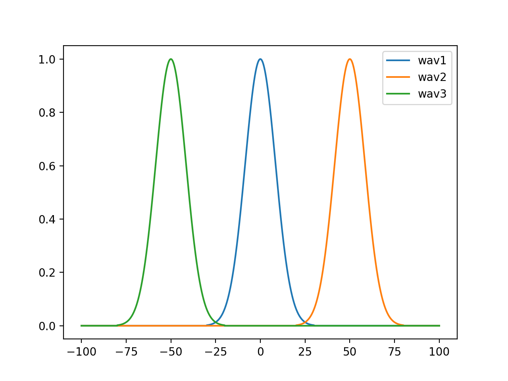

### + - * /

```python
t = np.linspace(-100, 100, 10001)

wav1 = gaussian(40) * square(30) - 1
wav2 = wav1 >> 50
wav3 = wav1 << 50

w1 = wav1 + wav2
w2 = wav2 - wav3

plt.plot(t, w1(t), label='wav1 + wav2')
plt.plot(t, w2(t), label='wav2 - wav3')
plt.legend()
plt.show()
```

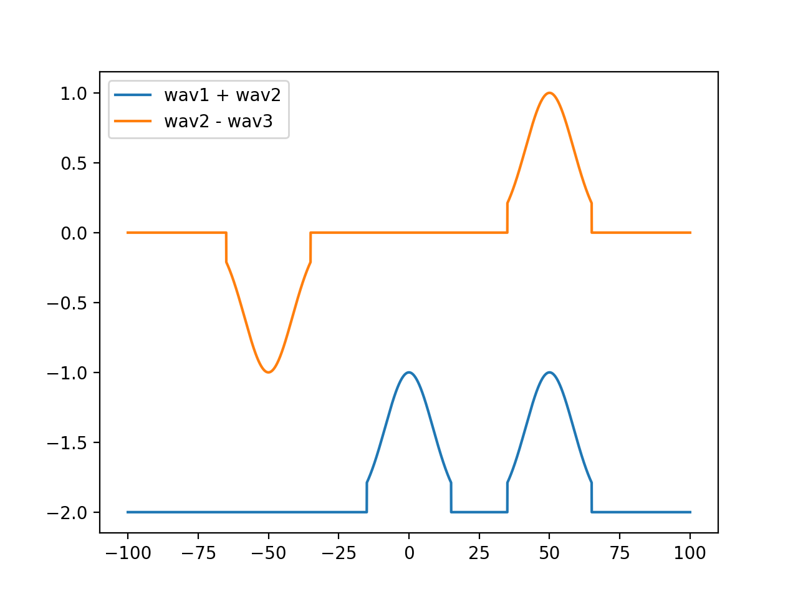

```python
t = np.linspace(-100, 100, 10001)

w1 = 0.5 * square(40) * cos(1) + 1
w2 = cosPulse(40) / 2

plt.plot(t, w1(t), label='w1')
plt.plot(t, w2(t), label='w2')
plt.legend()
plt.show()
```

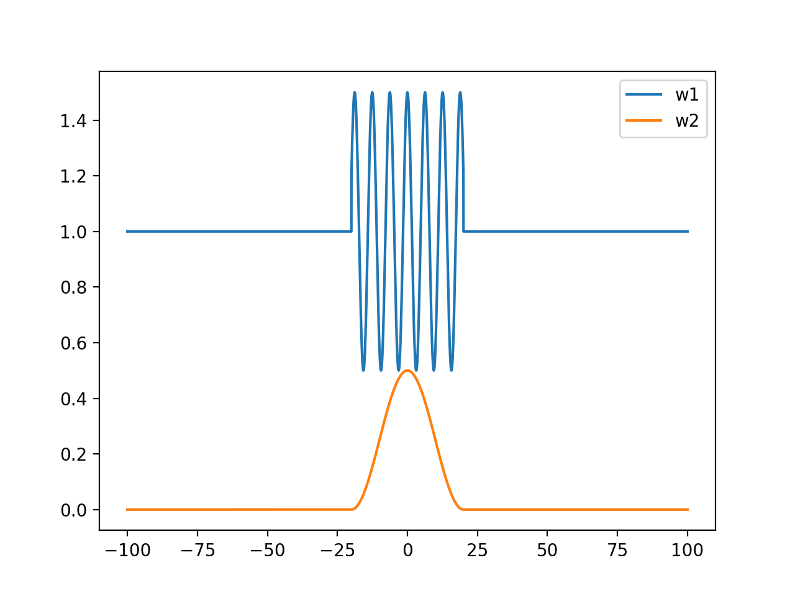

### compare

```python
w1 = gaussian(10)
w2 = w1 >> 12
w3 = 0.5 * w2

w1 - 2 * (w3 << 12) == 0
```

### derivative

```python
x = np.linspace(-10,10,1001)

w = (gaussian(8) >> 1)
dw = D(w)

plt.plot(x, w(x), label='f')
plt.plot(x, dw(x), label='df/dt')
plt.legend()
```

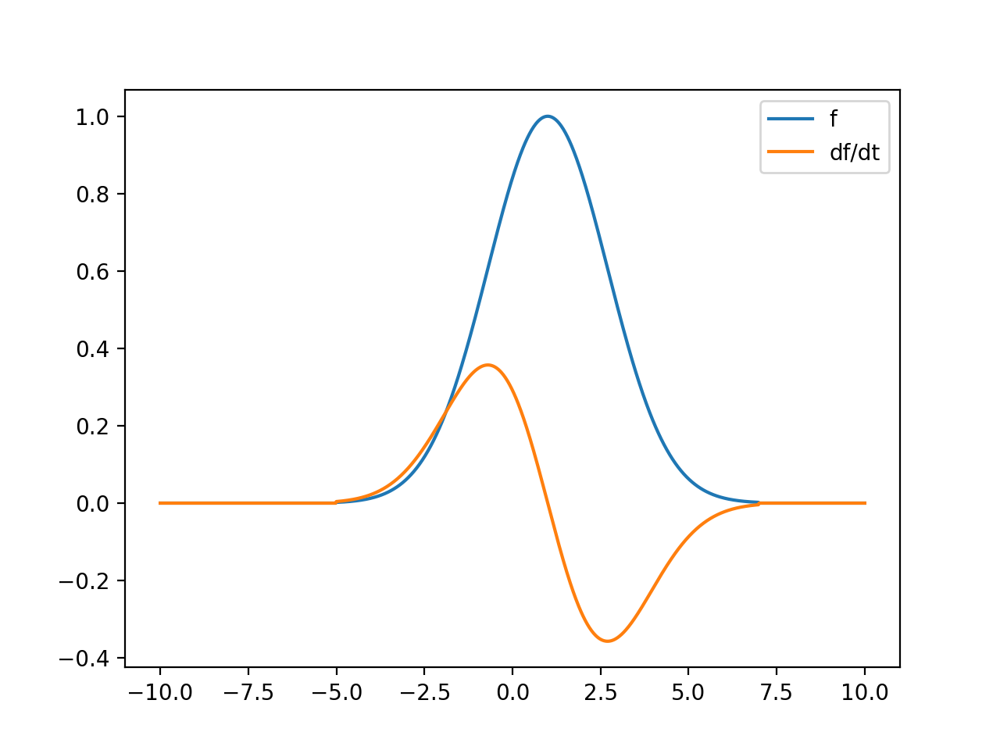

### cut

```python
x = np.linspace(-10,10,1001)

w = gaussian(10)
cw = cut(w, start=-2, stop=3)
cw2 = cut(w, start=-2, stop=3, head=0)
cw3 = cut(w, start=-2, stop=3, tail=0)
cw4 = cut(w, max=0.75)

plt.subplot(211)
plt.plot(x, w(x), label='f')
plt.plot(x, cw(x), label='cut(f)')
plt.plot(x, cw2(x), label='cut(f, head=0)')
plt.plot(x, cw3(x), label='cut(f, tail=0)')
plt.plot(x, cw4(x), label='cut(f, max=0.75)')

plt.legend()

w = sin(10)
cw = cut(w, start=-2, stop=3)
cw2 = cut(w, start=-2, stop=3, min=0)

plt.subplot(212)
plt.plot(x, w(x), label='f')
plt.plot(x, cw(x)-4, label='cut(f) - 4')
plt.plot(x, cw2(x)-8, label='cut(f, min=0) - 8')
plt.legend()
```

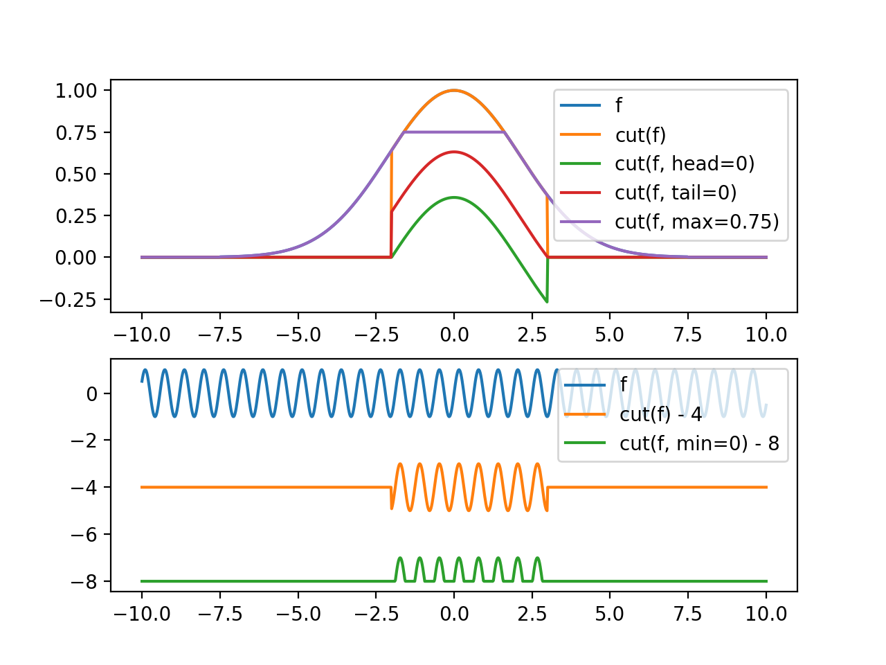

## mixing

### up conversion

```python
I = gaussian(100) * cos(2*pi*0.1)
Q = gaussian(100) * sin(2*pi*0.1)

plt.plot(t, I(t), label='I')
plt.plot(t, Q(t), label='Q')
plt.legend()
plt.show()
```

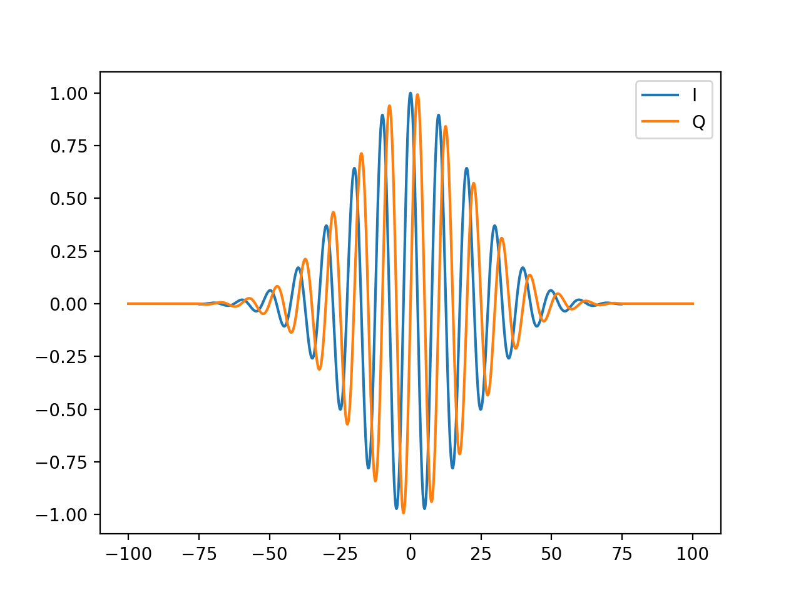

```python
I, Q = mixing(gaussian(100), freq=0.1, phase=0, DRAGScaling=0.2)

plt.plot(t, I(t)+1, label='I')
plt.plot(t, Q(t)+1, label='Q')

I, Q = mixing(gaussian(100), freq=0.1, phase=1, DRAGScaling=0.2)

plt.plot(t, I(t)-1, label='I phase=1')
plt.plot(t, Q(t)-1, label='Q phase=1')
plt.legend()
plt.show()
```

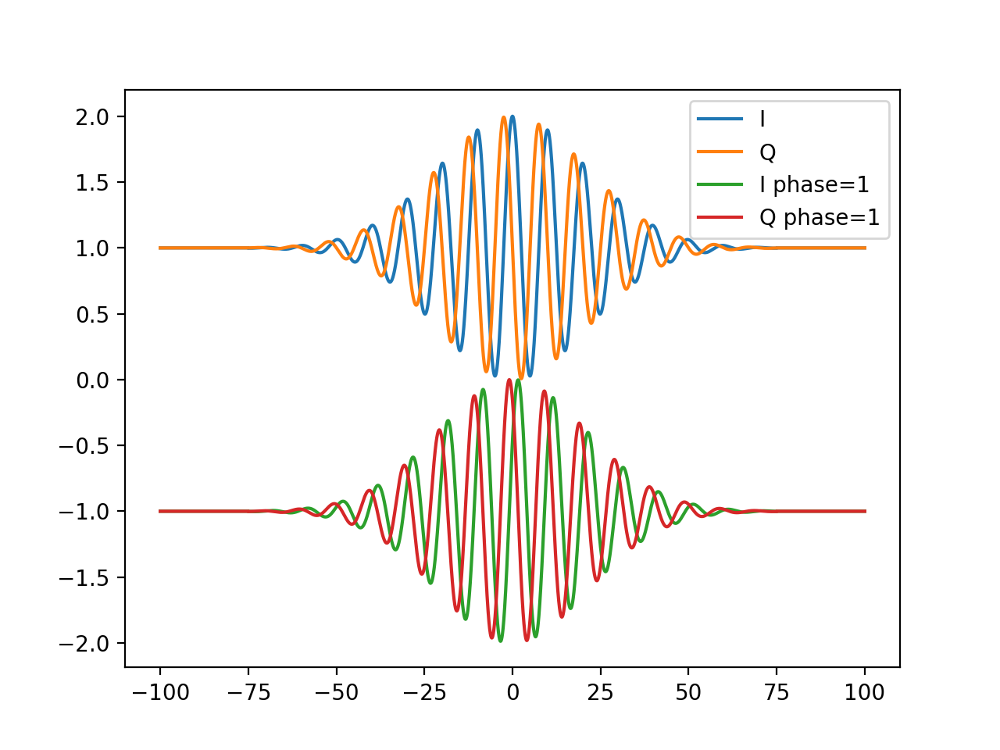

### down conversion

```python
rf, _ = mixing(gaussian(100), freq=92.0451, phase=0.32, DRAGScaling=0.0)

plt.plot(t, rf(t), label='rf', alpha=0.4)

lofreq = 92

I = (2 * rf * cos(-2 * pi * lofreq))
I = I.filter(high=2 * pi * lofreq)
plt.plot(t, I(t), label='I')

Q = (2 * rf * sin(-2 * pi * lofreq))
Q = Q.filter(high=2 * pi * lofreq)
plt.plot(t, Q(t), label='Q')

plt.legend()
plt.show()
```

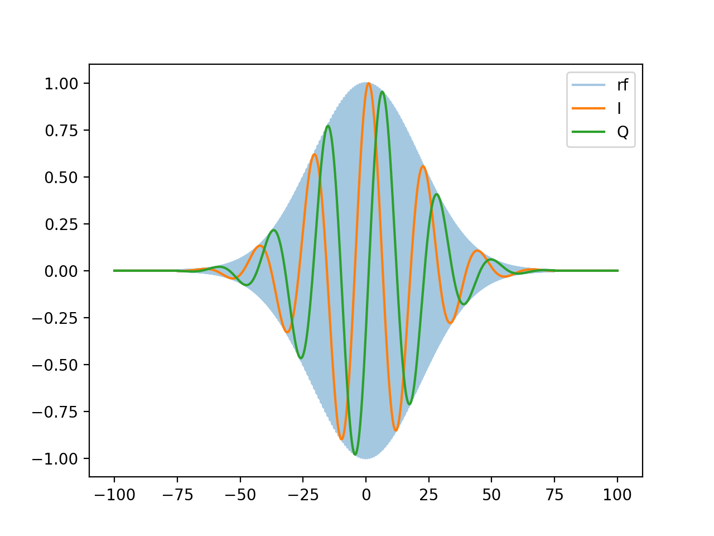

## basic waveforms

### DC

```python
x = np.linspace(-10,10,1001)

w1 = zero()
w2 = one()
w3 = const(0.4)

plt.plot(x, w1(x))
plt.plot(x, w2(x))
plt.plot(x, w3(x))
```

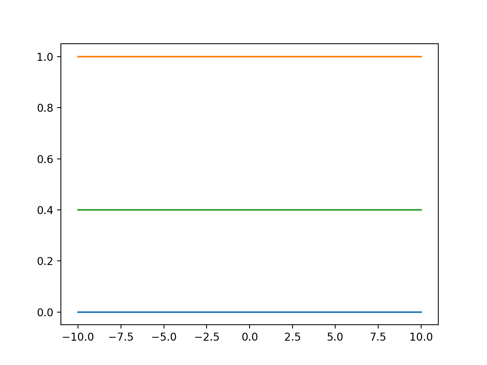

### Pulse


```python
x = np.linspace(-10,10,1001)

w = gaussian(8)
dw = D(w)

plt.subplot(211)
plt.plot(x, w(x))
plt.plot(x, dw(x))

w = cosPulse(8)
dw = D(w)

plt.subplot(212)
plt.plot(x, w(x))
plt.plot(x, dw(x))
```

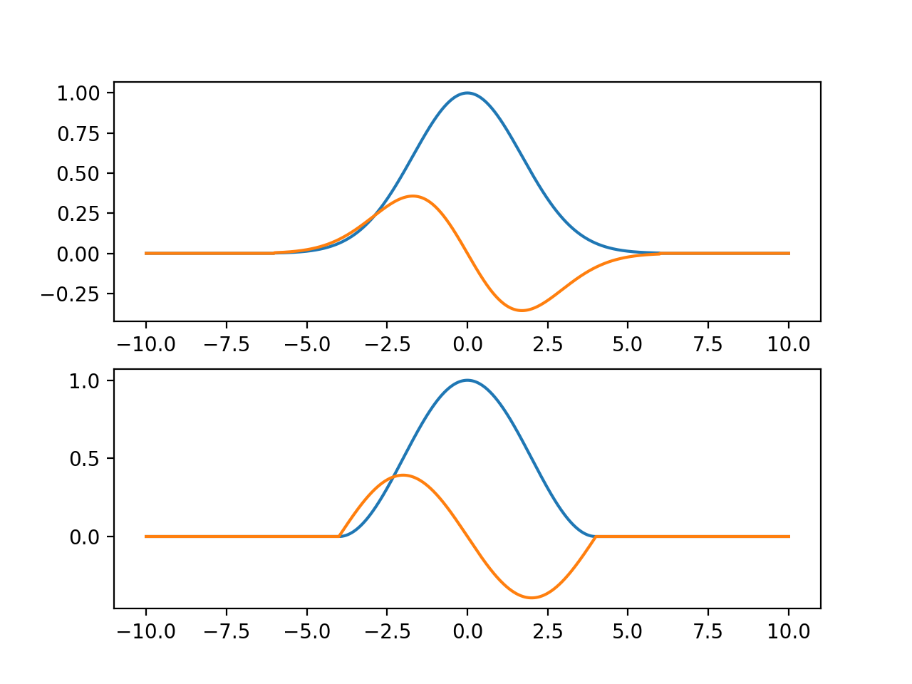


### sine


```python
x = np.linspace(-10,10,1001)

w1 = sin(1)
w2 = cos(1)
w3 = cos(1, phi=1.2)

plt.plot(x, w1(x))
plt.plot(x, w2(x))
plt.plot(x, w3(x))
```

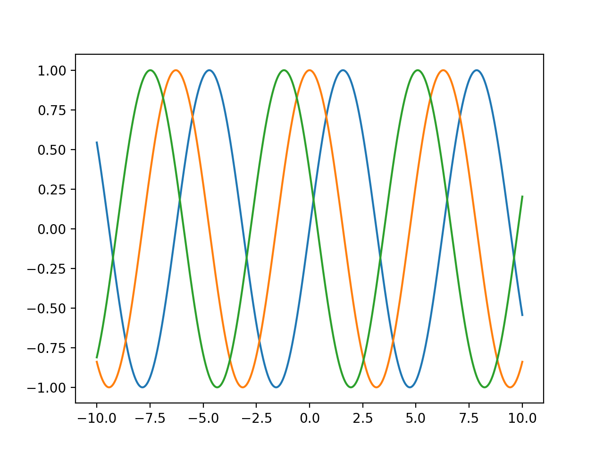


### square


```python
x = np.linspace(-10,10,1001)

w1 = square(10)
w2 = square(10, edge=3)
w3 = square(10, edge=3, type='linear')
w4 = square(10, edge=3, type='cos')

plt.plot(x, w1(x)+2)
plt.plot(x, w2(x))
plt.plot(x, w3(x)-2)
plt.plot(x, w4(x)-4)
```

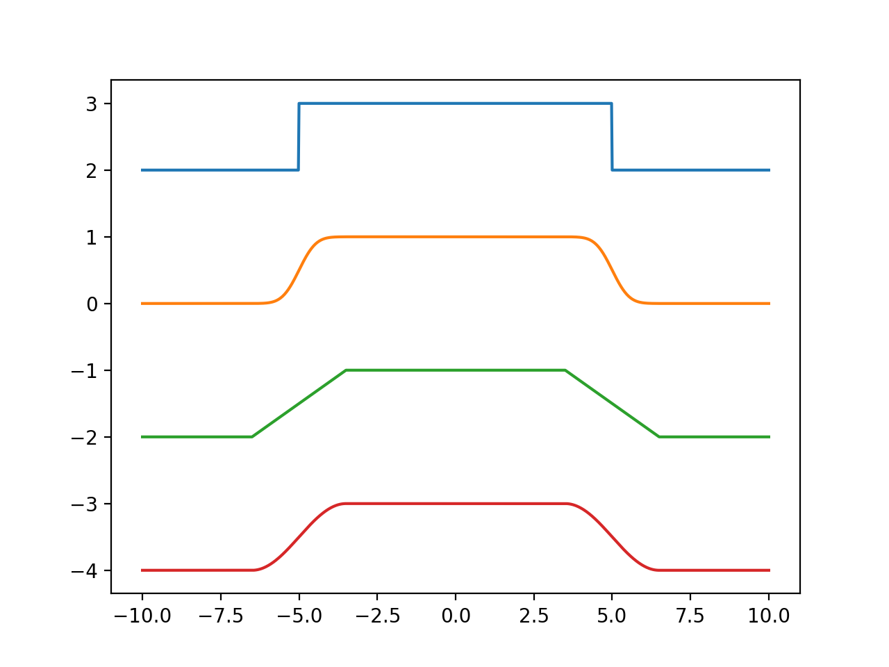


### step


```python
x = np.linspace(-10,10,1001)

w1 = step(0)
w2 = step(edge=3)
w3 = step(edge=3, type='linear')
w4 = step(edge=3, type='cos')

plt.plot(x, w1(x)+2)
plt.plot(x, w2(x))
plt.plot(x, w3(x)-2)
plt.plot(x, w4(x)-4)
```

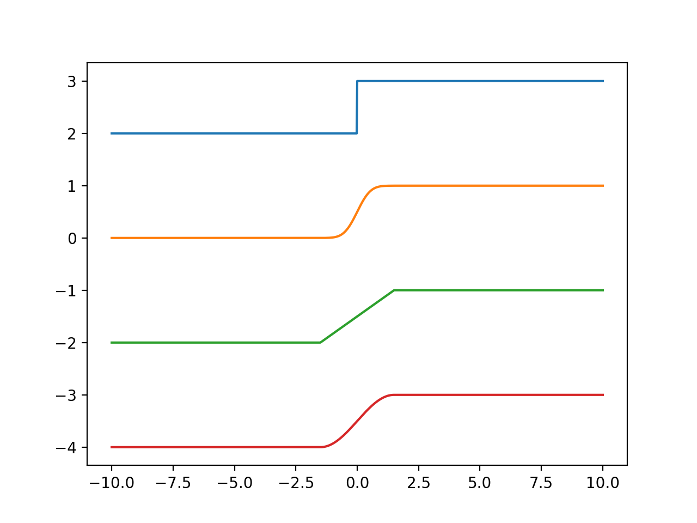

### poly


```python
x = np.linspace(-10,10,1001)
w = poly([1, -2, 0.5, 0.1])

plt.plot(x, w(x))
```

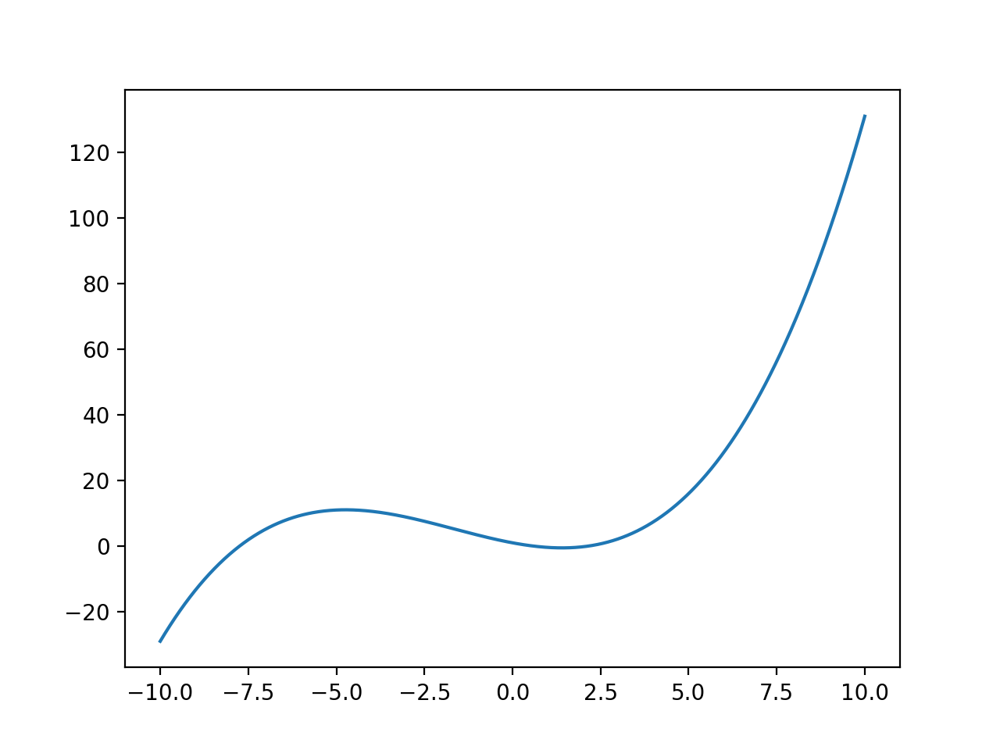


### exp and sinc


```python
plt.subplot(211)
x = np.linspace(0,10,1001)
w = exp(alpha=-1)
plt.plot(x, w(x))

plt.subplot(212)
x = np.linspace(-10,10,1001)
w = sinc(bw=1)
plt.plot(x, w(x))
```

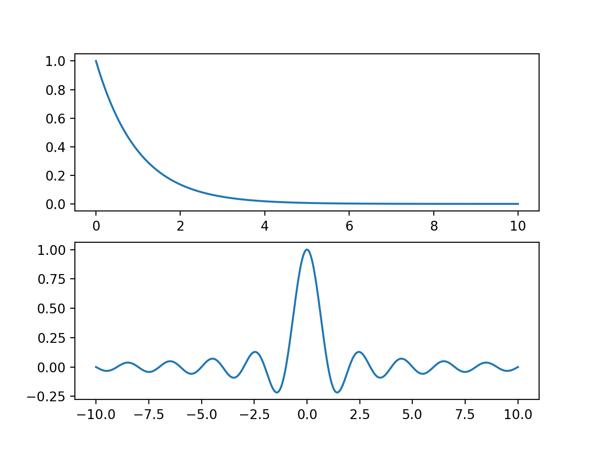


### interp

当插值的段数过多时,可能导致性能低下


```python
x = np.linspace(-10, 10, 1001)
w = interp(x=[-5, -3, -3, 0, 2, 4], y=[1, 2, -1, -1, 1, 0])
plt.plot(x, w(x))

w = w * sin(20)
plt.plot(x, w(x))
```

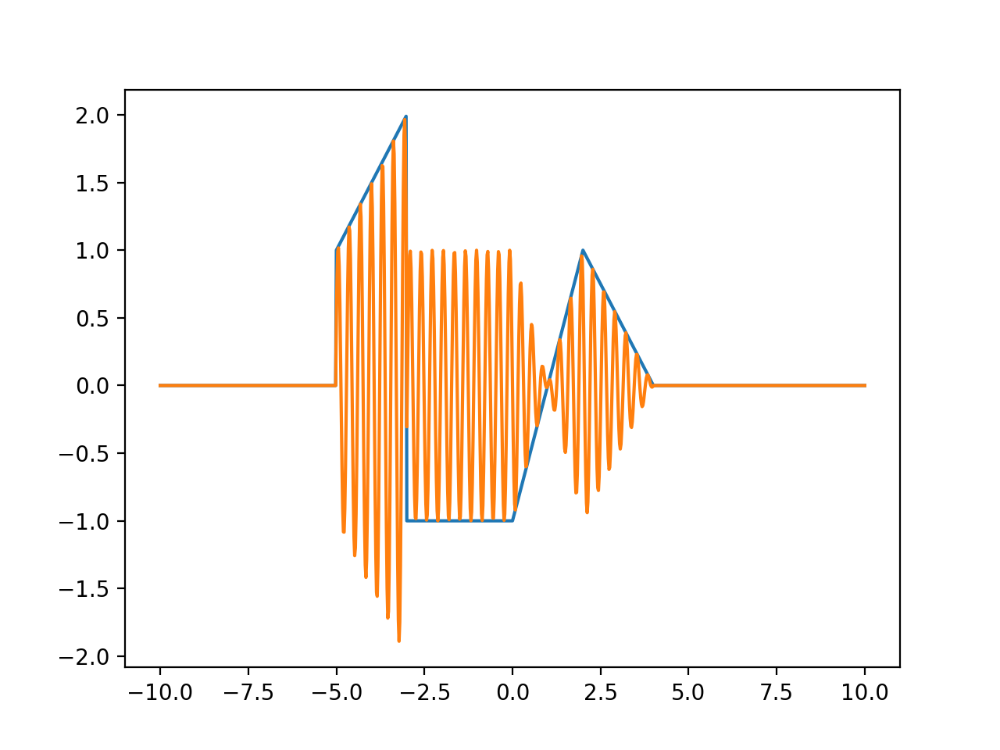

### function

该函数在 `wave_eval` 中不支持,该函数以及该函数参与过运算的波形均不支持求导运算 `D`.


```python
from scipy.special import jv

x = np.linspace(0, 100, 1001)

plt.plot(x, jv(3.1, x))

f = lambda t, v=3.1: jv(v, t)

w = function(f, start=0)

plt.plot(x, w(x))

w = (w >> 50)

plt.plot(x, w(x))

w = 0.4*(w << 20)+0.5

plt.plot(x, w(x))
```

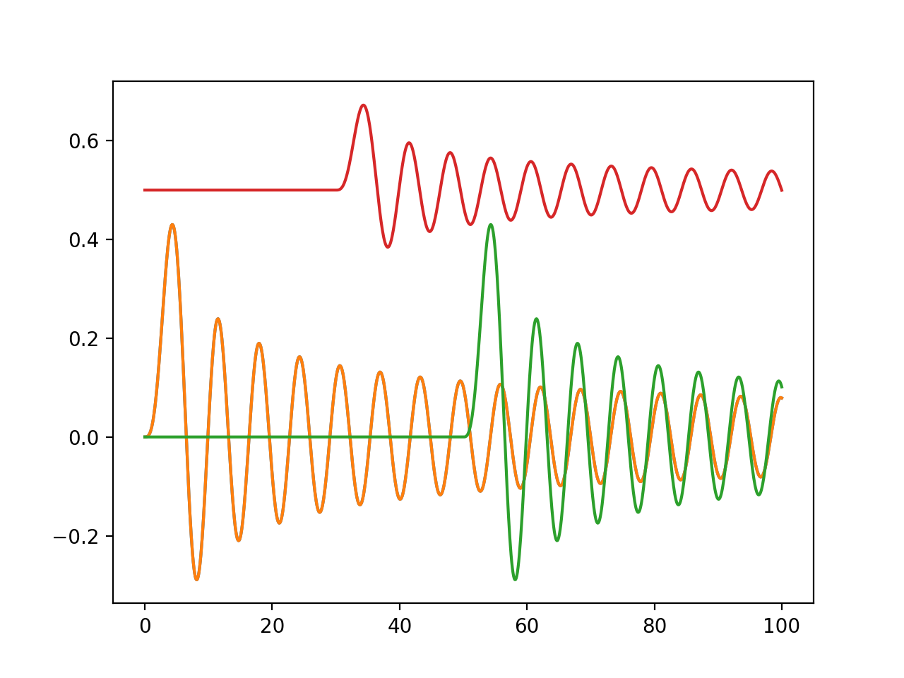


### samplingPoints

当定义波形的点数过多时,`samplingPoints`可能引起性能问题,因此非必要情况下尽可能避免使用该方式定义波形,该函数在 `wave_eval` 中不支持,当求导操作`D`的阶数过多时,精度会下降.


```python
from scipy.special import jv

x = np.linspace(0, 100, 1001)
y = jv(3.1, x)

plt.plot(x, y)

w = samplingPoints(start=0, stop=100, points=y)

plt.plot(x, w(x))

w = (w >> 50)

plt.plot(x, w(x))

w = 0.4*(w << 20)+0.5

plt.plot(x, w(x))
```

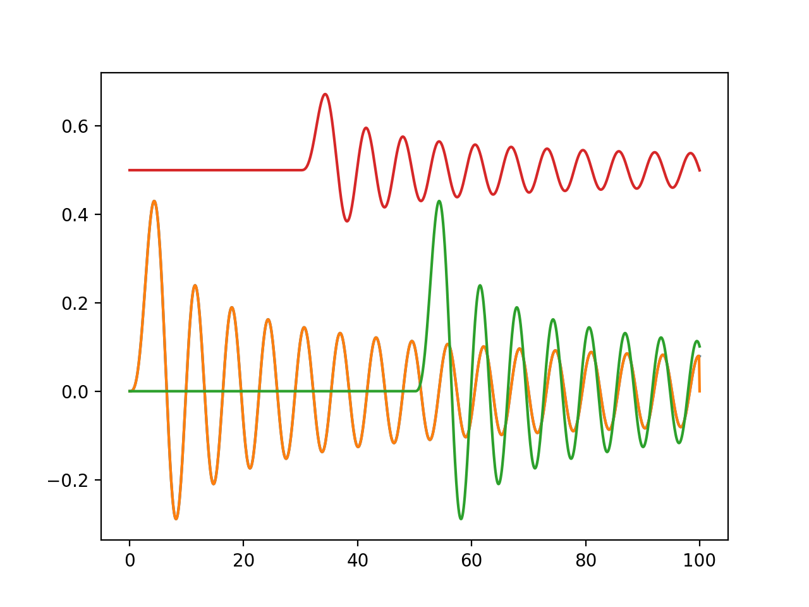

### parser


```python
w1 = wave_eval("(gaussian(12) >> 3) * cos(16.2, 1.63) + 0.5*(gaussian(12) >> 35) * cos(16.2, 2)")
w2 = (gaussian(12) >> 3) * cos(16.2, 1.63) + 0.5*(gaussian(12) >> 35) * cos(16.2, 2)

x = np.linspace(-10, 50, 10001)

plt.plot(x, w1(x))
plt.plot(x, w2(x))


w1 == w2
```

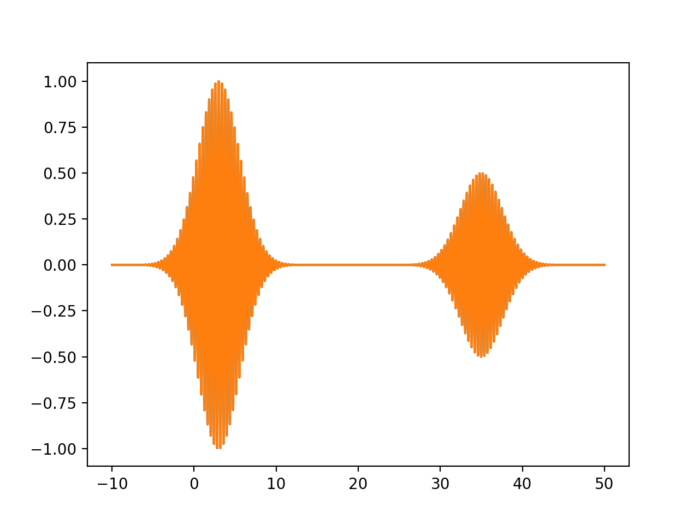


# circuit


```python
from waveforms import compile as Qcompile
from waveforms import libraries, stdlib
```

## complie QASM


```python
Qcompile("""
OPENQASM 2.0;
include "qelib1.inc";
qreg q[3];
qreg r[3];
h q;
cx q, r;
creg c[3];
creg d[3];
barrier q;
measure q->c;
measure r->d;
""", qasm_only=True)
```


    [(('U', 1.5707963267948966, 0.0, 3.141592653589793), 0),
     (('U', 1.5707963267948966, 0.0, 3.141592653589793), 1),
     (('U', 1.5707963267948966, 0.0, 3.141592653589793), 2),
     (('U', 1.5707963267948966, 0.0, 3.141592653589793), 3),
     (('U', 1.5707963267948966, 0.0, 3.141592653589793), 4),
     (('U', 1.5707963267948966, 0.0, 3.141592653589793), 5),
     ('CZ', (0, 3)),
     ('CZ', (1, 4)),
     ('CZ', (2, 5)),
     (('U', 1.5707963267948966, 0.0, 3.141592653589793), 3),
     (('U', 1.5707963267948966, 0.0, 3.141592653589793), 4),
     (('U', 1.5707963267948966, 0.0, 3.141592653589793), 5),
     ('Barrier', (0, 1, 2)),
     (('Measure', 0), 0),
     (('Measure', 1), 1),
     (('Measure', 2), 2),
     (('Measure', 3), 3),
     (('Measure', 4), 4),
     (('Measure', 5), 5)]


## compile circuit into basic gate


```python
Qcompile("""
OPENQASM 2.0;
include "qelib1.inc";
qreg q[3];
qreg r[3];
h q;
cx q, r;
creg c[3];
creg d[3];
barrier q;
measure q->c;
measure r->d;
""", no_assembly=True)
```


    [(('rfUnitary', 1.5707963267948966, -1.5707963267948966), 0),
     (('rfUnitary', 1.5707963267948966, -1.5707963267948966), 1),
     (('rfUnitary', 1.5707963267948966, -1.5707963267948966), 2),
     (('rfUnitary', 1.5707963267948966, -1.5707963267948966), 3),
     (('rfUnitary', 1.5707963267948966, -1.5707963267948966), 4),
     (('rfUnitary', 1.5707963267948966, -1.5707963267948966), 5),
     ('CZ', (0, 3)),
     ('CZ', (1, 4)),
     ('CZ', (2, 5)),
     (('rfUnitary', 1.5707963267948966, 1.5707963267948966), 3),
     (('rfUnitary', 1.5707963267948966, 1.5707963267948966), 4),
     (('rfUnitary', 1.5707963267948966, 1.5707963267948966), 5),
     ('Barrier', (0, 1, 2)),
     (('Measure', 0), 0),
     (('Measure', 1), 1),
     (('Measure', 2), 2),
     (('Measure', 3), 3),
     (('Measure', 4), 4),
     (('Measure', 5), 5)]


```python
Qcompile([
    ('H', 0),
    ('Cnot', (0, 1))
], no_assembly=True)
```


    [(('rfUnitary', 1.5707963267948966, -1.5707963267948966), 0),
     (('rfUnitary', 1.5707963267948966, -1.5707963267948966), 1),
     ('CZ', (0, 1)),
     (('rfUnitary', 1.5707963267948966, 1.5707963267948966), 1),
     (('P', 3.141592653589793), 0)]


## define gate


```python
lib = libraries(stdlib)


@lib.gate(2)
def iSWAP(qubits):
    c, t = qubits
    yield ('-X/2', c)
    yield ('-Y/2', t)
    
    yield ('CZ', (c, t))
    
    yield ('-X/2', c)
    yield ('Y/2', t)
    
    yield ('CZ', (c, t))
    
    yield ('X/2', c)
    yield ('Y/2', t)
    

Qcompile([
    ('X', 0),
    ('iSWAP', (0, 1))
], no_assembly=True, lib=lib)
```


    [(('rfUnitary', 3.141592653589793, -1.5707963267948966), 0),
     (('rfUnitary', 1.5707963267948966, 0.0), 0),
     (('rfUnitary', 1.5707963267948966, -1.5707963267948966), 1),
     ('CZ', (0, 1)),
     (('rfUnitary', 1.5707963267948966, 0.0), 0),
     (('rfUnitary', 1.5707963267948966, 1.5707963267948966), 1),
     ('CZ', (0, 1)),
     (('rfUnitary', 1.5707963267948966, -3.141592653589793), 0),
     (('rfUnitary', 1.5707963267948966, 1.5707963267948966), 1),
     (('P', 3.141592653589793), 0)]


## define opaque


```python
from waveforms import *


@lib.opaque('CZ')
def CZ(ctx, qubits):
    t = max(ctx.time[q] for q in qubits)

    duration = ctx.params['duration']
    amp = ctx.params['amp']

    if amp > 0 and duration > 0:
        pulse = amp * (cos(pi / duration) * square(duration)) >> duration / 2
        ctx.channel[('coupler.Z', *qubits)] += pulse >> t

    for qubit in qubits:
        ctx.time[qubit] = t + duration

    qubits = sorted(qubits, key=lambda s: int(s[1:]))
    ctx.phases[qubits[0]] += gate.params.phi1
    ctx.phases[qubits[1]] += gate.params.phi2


@lib.opaque('CZ', type='parametric')
def CZ(ctx, qubits):
    t = max(ctx.time[q] for q in qubits)

    duration = ctx.params['duration']
    amp = ctx.params['amp']
    offset = ctx.params['offset']
    frequency = ctx.params['frequency']

    if duration > 0:
        pulse = square(duration) >> duration / 2
        pulse = offset * pulse + amp * pulse * sin(2 * pi * frequency)
        ctx.channel[('coupler.Z', *qubits)] += pulse >> t

    for qubit in qubits:
        ctx.time[qubit] = t + duration

    qubits = sorted(qubits, key=lambda s: int(s[1:]))
    ctx.phases[qubits[0]] += ctx.params['phi1']
    ctx.phases[qubits[1]] += ctx.params['phi2']

```


```python
from typing import Union

from waveforms import setConfig


setConfig('/Users/feihoo87/Nutstore Files/baqis/代码程序/XHK/config2.json')


code = Qcompile([('X', 'Q14'), ('iSWAP', ('Q14', 'Q15')),
                 ('Barrier', ('Q14', 'Q15')), (('Measure', 0), 'Q14'),
                 (('Measure', 1), 'Q15')],
                lib=lib)
```


```python
code.waveforms
```


    {'AWG.X20': <waveforms.waveform.Waveform at 0x11f748d40>,
     'AWG.X10': <waveforms.waveform.Waveform at 0x120171dc0>,
     'AWG.Z14': <waveforms.waveform.Waveform at 0x1201713c0>,
     'AWG.RI2': <waveforms.waveform.Waveform at 0x1201710c0>,
     'AWG.RQ2': <waveforms.waveform.Waveform at 0x1201739c0>,
     'AWG.RI2.Marker1': <waveforms.waveform.Waveform at 0x120173a40>,
     'AWG.RI3': <waveforms.waveform.Waveform at 0x11f9cd200>,
     'AWG.RQ3': <waveforms.waveform.Waveform at 0x12016d680>,
     'AWG.RI3.Marker1': <waveforms.waveform.Waveform at 0x12016d100>}


```python
x = np.linspace(0, 5e-6, 10001)
for i, (k, w) in enumerate(code.waveforms.items()):
    if k.endswith('Marker1'):
        plt.plot(x, (w(x)>0)-2*i, label=k)
    else:
        plt.plot(x, w(x)-2*i, label=k)
    
plt.legend()
plt.show()
```

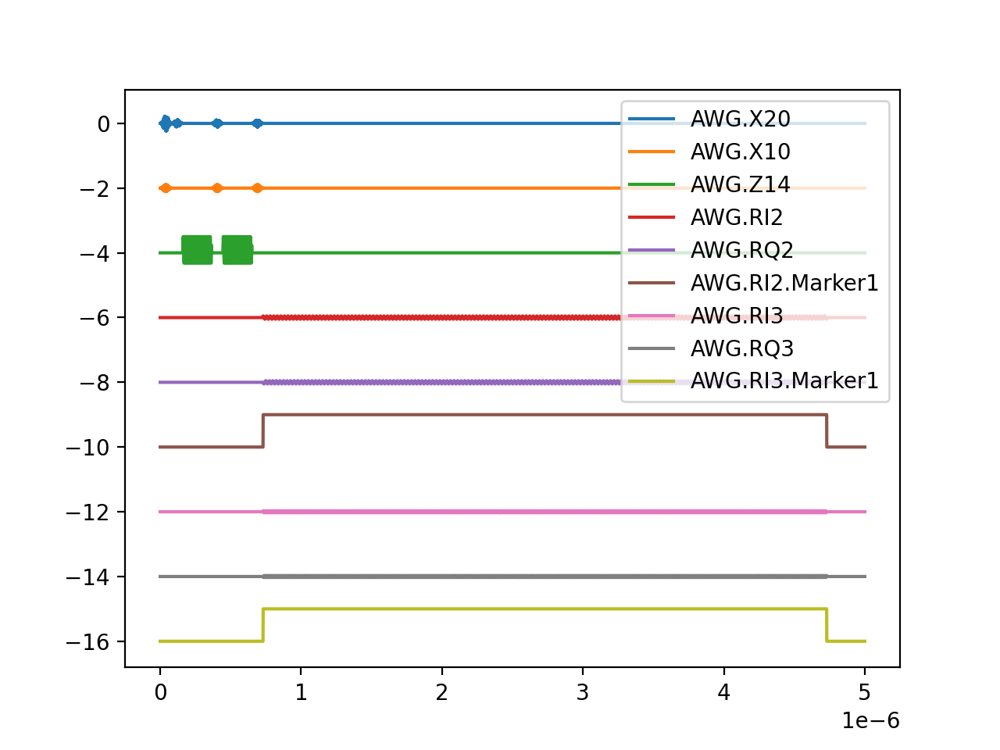


```python
code.measures
```


    {0: [MeasurementTask(qubit='Q14', cbit=0, time=7.299999999999999e-07, signal='state', params={'frequency': 6950360000, 'duration': 4e-06, 'amp': 0.05, 'phi': -2.372343174119819, 'threshold': -26191224672.436996, 'w': None, 'weight': array([0.01182581, 0.0119132 , 0.01200115, ..., 0.95989632, 0.95988672,
             0.95987712])}, hardware={'channel': {'LO': 'PSG.ReadLO1', 'IQ': 'AD.T2'}, 'params': {'LOFrequency': 6990000000.0, 'sampleRate': {'IQ': 1000000000}}})],
     1: [MeasurementTask(qubit='Q15', cbit=1, time=7.299999999999999e-07, signal='state', params={'frequency': 6728030000.0, 'duration': 4e-06, 'amp': 0.03, 'phi': 1.3007398318909447, 'threshold': 36578312262.22008, 'w': None, 'weight': array([0.01182581, 0.0119132 , 0.01200115, ..., 0.95989632, 0.95988672,
             0.95987712])}, hardware={'channel': {'LO': 'PSG.ReadLO2', 'IQ': 'AD.T3'}, 'params': {'LOFrequency': 6830000000.0, 'sampleRate': {'IQ': 1000000000}}})]}


# QLisp Syntax

QLisp 本质为 OpenQASM 的一个子集,相比 OpenQASM 去掉了 gate 声明、regester 声明、if 分支等语法,使其可以更直接地映射到现有具体硬件系统中.

其基本语法如下

```
circuit := [ statement, ... ]

statement := (gate, target)

target := str
       |= int
       |= (str, str, ...)
       |= (int, int, ...)
     
gate := str
     |= (str, *args)
     |= ('C', gate)
```

具体来讲,一个量子线路由若干`statement`组成的`list`描述. 其中每一条`statement`是一个`gate`,`target`对.

如`('H', 'Q0')`表示在`Q0`上做`H`门,`('Cnot', ('Q4','Q2'))`表示以`Q4`为控制比特,`Q2`为目标比特做`Cnot`门.

含参的量子门由字符串和参数共同组成,如`(('fSim', np.pi, np.pi/4), (1,3))`表示在第`1`个和第`3`个比特上做$\theta=\pi,\phi=\pi/4$的`fSim`门.


$\color{red}{\text{Not Implemented}}$ 关键词 `C` 可以定义受控门,如`('C', 'Cnot')`或`('C', ('C', 'X'))`均表示Toffoli门(ccnot),`('C', 'SWAP')`表示Fredkin门(cswap).

测量操作实际上是一个含参的非幺正门,如`(('Measure', 0), 'Q0')`表示测量量子比特`Q0`,结果放置在第0个经典位上.


举例说明,如图所示的线路,可表述为


```python
from numpy import pi

circuit = [
    ('H', 'Q0'),
    ('Cnot', ('Q4', 'Q3')),
    ('CZ', ('Q0', 'Q1')),
    (('Ry', pi/2), 'Q1'),
    (('Measure', 0), 'Q1'),
    (('C', ('Rx', pi/2)), ('Q1', 'Q2')),     #
    (('C', 'Cnot'), ('Q0', 'Q1', 'Q2')),     #   C 关键词目前尚未支持
    (('C', 'Cnot'), ('Q1', 'Q3', 'Q2')),     #
    ('Reset', 'Q0'),
    ('Barrier', ('Q0', 'Q1', 'Q2')),
    (('Measure', 1), 'Q1'),
    (('Measure', 2), 'Q2'),
]
```

## basic gate

硬件层面最基本的单比特操作是微波脉冲实现的`rfUnitary`门和相位`P`门,由它们可以组合出单比特通用门`U`,最基本的两比特门为`CZ`门,它们的幺正矩阵分别为


```python
def rfUnitary(theta, phi):
    """
    Gives the unitary operator for an ideal microwave gate.
    phi gives the rotation axis on the plane of the bloch sphere (RF drive phase)
    theta is the rotation angle of the gate (pulse area)

    rfUnitary(theta, phi) := expm(-1j * theta / 2 * \
        (sigmaX() * cos(phi) + sigmaY() * sin(phi)))

    rfUnitary(theta, phi + pi/2) == U(theta, phi, -phi)
    """
    c, s = np.cos(theta / 2), np.sin(theta / 2)
    return np.array([[c, -1j * s * np.exp(-1j * phi)],
                     [-1j * s * np.exp(1j * phi), c]])


def U(theta, phi, lambda_, delta=0):
    """general unitary
    
    Any general unitary could be implemented in 2 pi/2-pulses on hardware

    U(theta, phi, lambda_, delta) = \
        np.exp(1j * delta) * \
        U(0, 0, theta + phi + lambda_) @ \
        U(np.pi / 2, p2, -p2) @ \
        U(np.pi / 2, p1, -p1))

    or  = \
        np.exp(1j * delta) * \
        P(theta + phi + lambda_) @ \
        rfUnitary(np.pi / 2, p2 + pi / 2) @ \
        rfUnitary(np.pi / 2, p1 + pi / 2)
    
    where p1 = -lambda_ - pi / 2
          p2 = pi / 2 - theta - lambda_
    """
    c, s = np.cos(theta / 2), np.sin(theta / 2)
    a, b = (phi + lambda_) / 2, (phi - lambda_) / 2
    d = np.exp(1j * delta)
    return d * np.array([[c * np.exp(-1j * a), -s * np.exp(-1j * b)],
                         [s * np.exp(1j * b), c * np.exp(1j * a)]])


def P(lambda_):
    return U(0, 0, lambda_)


def CZ():
    return np.array([
        [1, 0, 0, 0],
        [0, 1, 0, 0],
        [0, 0, 1, 0],
        [0, 0, 0,-1]
    ])

```

比如,线路
```python
[('H', 'Q0'), ('Cnot', ('Q0', 'Q1'))]
```
会被转换成如下线路再在硬件上运行
```python
[
    (('rfUnitary', 1.5707963267948966, -1.5707963267948966), 'Q0'),
    (('rfUnitary', 1.5707963267948966, -1.5707963267948966), 'Q1'),
    ('CZ', ('Q0', 'Q1')),
    (('rfUnitary', 1.5707963267948966, 1.5707963267948966), 'Q1'),
    (('P', 3.141592653589793), 'Q0')
]
```

此外,还有三个辅助指令`Delay`,`Barrier` 和 `Measure`

### Delay

`Delay` 含一个 float 类型的参数 `t`,表示将目标比特后续操作延迟指定时间,比如测量 $T1$ 的线路为
```python
[('X', 'Q1'), (('Delay', t), 'Q1'), (('Measure', 0), 'Q1')]
```
`t` 的单位为秒

### Barrier

`Barrier` 可作用于任意个量子比特,将所作用的各比特时间对齐,比如同时测量三个比特的 $T1$ 可用以下线路
```python
[
    ('X', 'Q0'),
    ('X', 'Q1'),
    ('X', 'Q2'),
    ('Barrier', ('Q0', 'Q1', 'Q2')),
    (('Delay', t), 'Q0'),
    ('Barrier', ('Q0', 'Q1', 'Q2')),
    (('Measure', 0), 'Q0'),
    (('Measure', 0), 'Q1'),
    (('Measure', 0), 'Q2')
]
```

### Measure

`Measure` 含一个 int 类型的参数 `cbit`,表示将目标比特的测量结果放置在输出 bit-word 的第 `cbit` 位上

### others

| statement | gate | matrix | Description |
|:---------:|:----:|:------:|:-----------:|
|`('I', 'Q0')`|  $$I$$   | $$\begin{pmatrix}1 & 0\\0 & 1\end{pmatrix}$$ | |
|`('X', 'Q0')`|  $$\sigma_x$$   | $$\begin{pmatrix}0 & 1\\1 & 0\end{pmatrix}$$ | |
|`('Y', 'Q0')`|  $$\sigma_y$$   | $$\begin{pmatrix}0 & -i\\i & 0\end{pmatrix}$$ | |
|`('Z', 'Q0')`|  $$\sigma_z$$   | $$\begin{pmatrix}1 & 0\\0 & -1\end{pmatrix}$$ | |
|`('H', 'Q0')`|  $$H$$   | $$\frac{1}{\sqrt{2}}\begin{pmatrix}1 & 1\\1 & -1\end{pmatrix}$$ | |
|`('S', 'Q0')`|  $$S$$   | $$\begin{pmatrix}1 & 0\\0 & i\end{pmatrix}$$ | |
|`('-S', 'Q0')`|  $$S^{\dagger}$$   | $$\begin{pmatrix}1 & 0\\0 & -i\end{pmatrix}$$ | |
|`('T', 'Q0')`|  $$T$$   | $$\begin{pmatrix}1 & 0\\0 & e^{i\pi/4}\end{pmatrix}$$ | |
|`('-T', 'Q0')`|  $$T^{\dagger}$$   | $$\begin{pmatrix}1 & 0\\0 & e^{-i\pi/4}\end{pmatrix}$$ | |
|`(('Rx', theta), 'Q0')`|  $$R_x(\theta)$$   | $$\exp\left(-i\frac{\theta}{2}\sigma_x\right)$$ | |
|`(('Ry', theta), 'Q0'`|  $$R_y(\theta)$$   | $$\exp\left(-i\frac{\theta}{2}\sigma_y\right)$$ | |
|`(('Rz', phi), 'Q0')`|  $$R_z(\theta)$$   | $$\exp\left(-i\frac{\phi}{2}\sigma_z\right)$$ | |
|`('X/2', 'Q0')`|  $$R_x(\pi/2)$$   | $$\exp\left(-i\frac{\pi}{4}\sigma_x\right)$$ | |
|`('-X/2', 'Q0')`|  $$R_x(-\pi/2)$$   | $$\exp\left(i\frac{\pi}{4}\sigma_x\right)$$ | |
|`('Y/2', 'Q0')`|  $$R_y(\pi/2)$$   | $$\exp\left(-i\frac{\pi}{4}\sigma_y\right)$$ | |
|`('-Y/2', 'Q0')`|  $$R_y(-\pi/2)$$   | $$\exp\left(i\frac{\pi}{4}\sigma_y\right)$$ | |
|`('iSWAP', ('Q0', 'Q1'))`|  $$i\mathrm{SWAP}$$   | $$\begin{pmatrix}1&0&0&0\\0&0&i&0\\0&i&0&0\\0&0&0&1\end{pmatrix}$$ | |
|`('Cnot', ('Q0', 'Q1'))`|  C-Not   | $$\begin{pmatrix}1&0&0&0\\0&1&0&0\\0&0&0&1\\0&0&1&0\end{pmatrix}$$ | |

# 量子云 API


```python
from typing import Literal, Union

Gate = Union[str, tuple]
Target = Union[str, int, tuple[str, ...], tuple[int, ...]]
QLisp = list[tuple[Gate, Target]]

SignalType = Literal['raw', 'state', 'count']
ResultType = Union[list[tuple[complex]], list[tuple[int]], dict[tuple[int],
                                                                int]]


def run(circut: QLisp,
        shots: int = 1024,
        signal: SignalType = 'count') -> ResultType:
    """
    run a QLisp circuit.

    Args:
        circut: a QLisp circuit
        shots: the number of shots
        signal: the type of signal to return

    Returns:
        if signal == 'raw'
        return a ndarray with shape = (shots, cbits) and dtype=complex
        
        if signal == 'state'
        return a ndarray with shape = (shots, cbits) and dtype=np.unit8
        
        if signal == 'count'
        return a dict like {(0, 0, 0): 231, (0, 0, 1): 452, ...}
        the keys express the readout bit-word and values denote the counts
    """
    pass
```